# Reutilização de Software - FrontEnd

## Introdução
A reutilização de software é um conceito fundamental no desenvolvimento de software, que visa maximizar a eficiência e a produtividade ao utilizar componentes ou partes de código existentes em diferentes projetos. A reutilização de software oferece uma série de benefícios, como redução de tempo de desenvolvimento, aumento da qualidade do software e diminuição de custos.

Neste documento, discutiremos a reutilização de software e como ela foi aplicada no código desenvolvido.

## Reutilização de Software no Código Desenvolvido
No código desenvolvido, foram aplicados princípios de reutilização de software por meio da criação de componentes reutilizáveis. Esses componentes foram projetados de forma genérica e flexível, permitindo seu uso em diferentes partes do aplicativo.

<figcaption align='center'>
    <b>Figura : Componentes e telas do Codigo</b>
     <small>Autores: Abdul Hannan, Heitor Marques</small>
</figcaption>

Foram criados os seguintes componentes reutilizáveis:
 

### Card
 Um componente que exibe informações em um formato de cartão. O componente recebe as propriedades title e content para exibir o título e o conteúdo do cartão, respectivamente. Esse componente pode ser reutilizado em várias partes do aplicativo, como na tela de Compras.

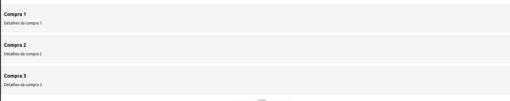
<figcaption align='center'>
    <b>Figura : Interface Card</b>
     <small>Autores: Abdul Hannan, Heitor Marques</small>
</figcaption>

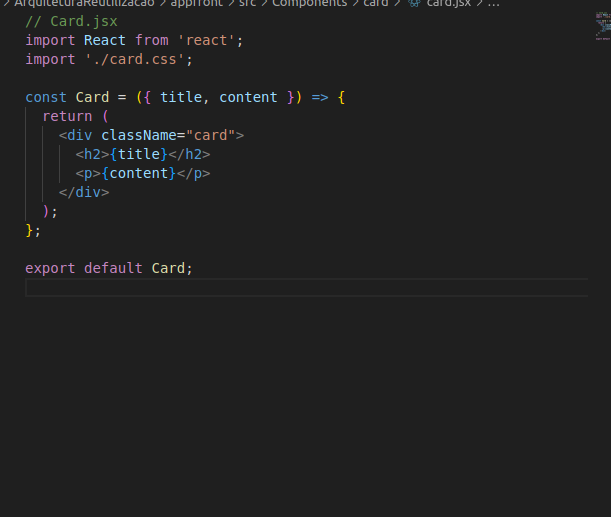
<figcaption align='center'>
    <b>Figura : Codigo</b>
     <small>Autores: Abdul Hannan, Heitor Marques</small>
</figcaption>

 <!-- 

  

    
  

  <figcaption align='center'>
    <b>Figura : Interface Card</b>
     <small>Autores: Abdul Hannan, Heitor Marques</small>
  </figcaption>
   
  

    
  

  <figcaption align='center'>
    <b>Figura : Codigo</b>
     <small>Autores: Abdul Hannan, Heitor Marques</small>
  </figcaption>

 -->

 

### Button
 Um componente de botão que recebe as propriedades onClick, text e style. Esse componente pode ser usado para criar botões interativos em diferentes partes do aplicativo, como na tela de Reclamação, Estorno e Devolução.

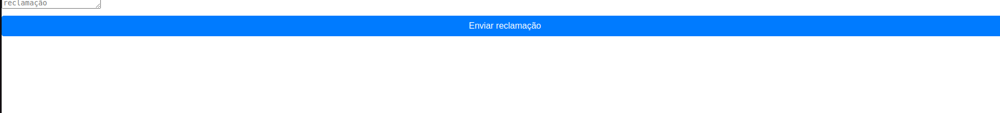
<figcaption align='center'>
    <b>Figura : Interface Button</b>
     <small>Autores: Abdul Hannan, Heitor Marques</small>
</figcaption>

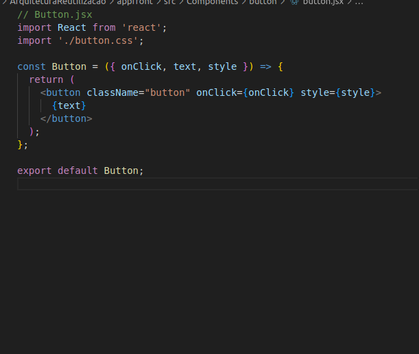
<figcaption align='center'>
    <b>Figura : Codigo</b>
     <small>Autores: Abdul Hannan, Heitor Marques</small>
</figcaption>

 <!-- 

  
  <figcaption align='center'>
    <b>Figura : Interface Button</b>
     <small>Autores: Abdul Hannan, Heitor Marques</small>
  </figcaption>
   
  
  <figcaption align='center'>
    <b>Figura : Codigo</b>
     <small>Autores: Abdul Hannan, Heitor Marques</small>
  </figcaption>

 -->

 

### Form
 Um componente de formulário flexível que recebe as propriedades fields, onSubmit e buttonText. O componente gera campos de entrada de acordo com as propriedades fornecidas em fields e executa a função onSubmit quando o formulário é submetido. Esse componente pode ser reutilizado para criar diferentes formulários em várias partes do aplicativo, como na tela de Reclamação, Estorno e Devolução.

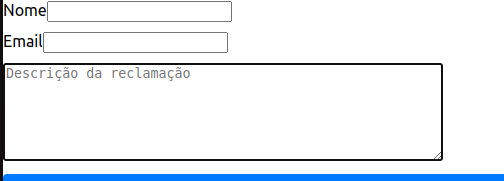
<figcaption align='center'>
    <b>Figura : Interface Form</b>
     <small>Autores: Abdul Hannan, Heitor Marques</small>
</figcaption>

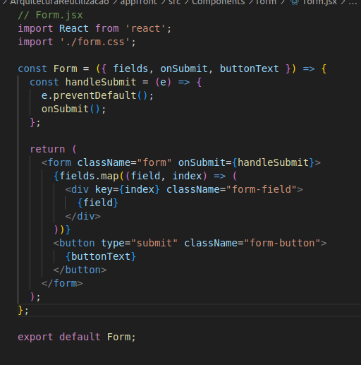
<figcaption align='center'>
    <b>Figura : Codigo</b>
     <small>Autores: Abdul Hannan, Heitor Marques</small>
</figcaption>

 <!-- 

  
  <figcaption align='center'>
    <b>Figura : Interface Form</b>
     <small>Autores: Abdul Hannan, Heitor Marques</small>
  </figcaption>
       
  
  <figcaption align='center'>
    <b>Figura : Codigo</b>
     <small>Autores: Abdul Hannan, Heitor Marques</small>
  </figcaption>

 -->

 

### Title
 Um componente de título simples que recebe a propriedade text para exibir um título. Esse componente pode ser usado para fornecer um título para diferentes seções do aplicativo, como nas telas de Compras, Reclamação, Estorno e Devolução.

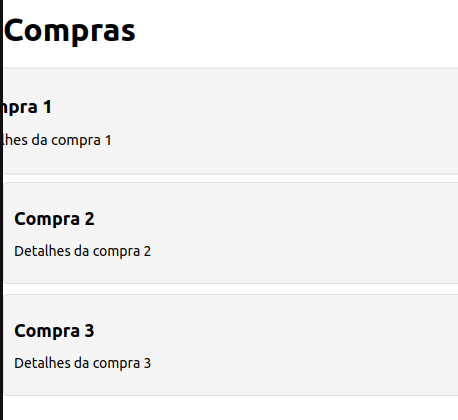
<figcaption align='center'>
    <b>Figura : Interface Title</b>
     <small>Autores: Abdul Hannan, Heitor Marques</small>
</figcaption>

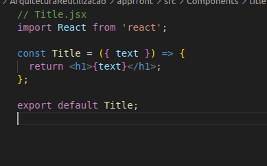
<figcaption align='center'>
    <b>Figura : Codigo</b>
     <small>Autores: Abdul Hannan, Heitor Marques</small>
</figcaption>

<!-- 

  
  <figcaption align='center'>
    <b>Figura : Interface Title</b>
     <small>Autores: Abdul Hannan, Heitor Marques</small>
  </figcaption>
   
  
  <figcaption align='center'>
    <b>Figura : Codigo</b>
     <small>Autores: Abdul Hannan, Heitor Marques</small>
  </figcaption>
  

 -->

 

### ErrorAlert
Um componente de Error PopUp simples que recebe a propriedade text para exibir um título. Esse componente pode ser usado para fornecer Erro em cenarios diferentes.

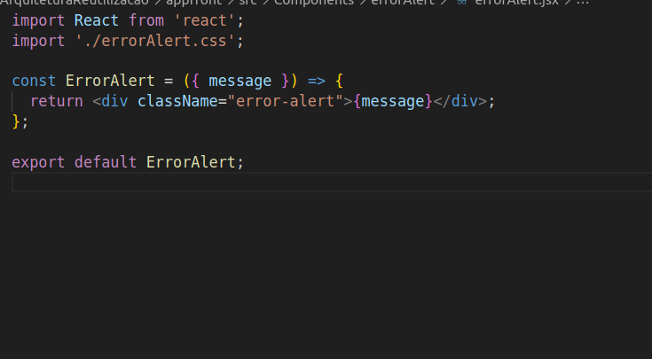
<figcaption align='center'>
    <b>Figura : Interface ErrorAlert e Codigo</b>
     <small>Autores: Abdul Hannan, Heitor Marques</small>
</figcaption>

<!-- 

  
  

<figcaption align='center'>
    <b>Figura : Interface ErrorAlert e Codigo</b>
     <small>Autores: Abdul Hannan, Heitor Marques</small>
</figcaption> -->
 

### LoadingSpinner
O componente LoadingSpinner é um componente simples que exibe um indicador de carregamento na tela. Ele fornece um indicador visual para o usuário de que um processo ou dados estão sendo carregados. O componente foi projetado para ser reutilizável e pode ser facilmente integrado em qualquer parte da aplicação onde o carregamento seja necessário.

<figcaption align='center'>
    <b>Figura : Interface LoadingSpinner</b>
     <small>Autores: Abdul Hannan, Heitor Marques</small>
</figcaption>

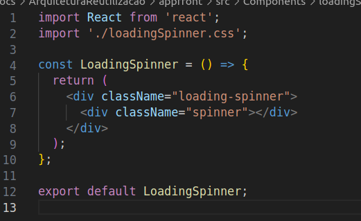
<figcaption align='center'>
    <b>Figura : Codigo</b>
     <small>Autores: Abdul Hannan, Heitor Marques</small>
</figcaption>

<!-- 

  
  <figcaption align='center'>
    <b>Figura : Interface LoadingSpinner</b>
     <small>Autores: Abdul Hannan, Heitor Marques</small>
  </figcaption>
   
   
   <figcaption align='center'>
    <b>Figura : Codigo</b>
     <small>Autores: Abdul Hannan, Heitor Marques</small>
  </figcaption>

 -->

 

### Pagination
O componente Pagination é um componente reutilizável que fornece funcionalidade de paginação. Ele permite que os usuários naveguem por um grande conjunto de dados divididos em várias páginas. O componente recebe várias props: totalItems, itemsPerPage, currentPage e onPageChange.

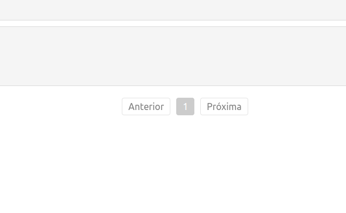
<figcaption align='center'>
    <b>Figura : Interface Paginacao</b>
     <small>Autores: Abdul Hannan, Heitor Marques</small>
</figcaption>

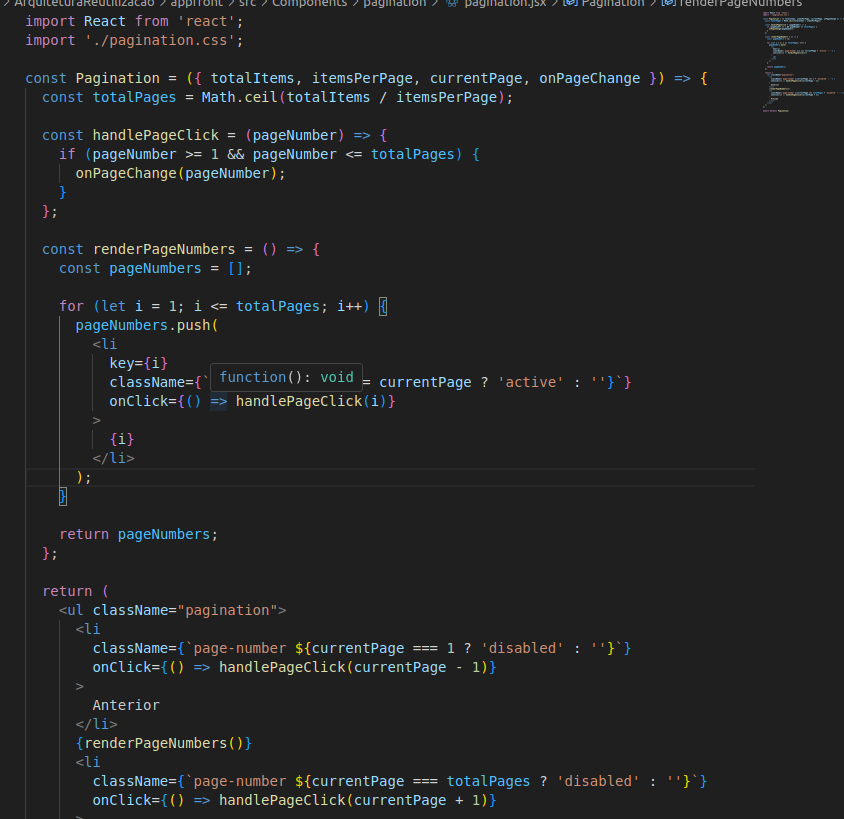
<figcaption align='center'>
    <b>Figura : Codigo</b>
     <small>Autores: Abdul Hannan, Heitor Marques</small>
</figcaption>

<!-- 

  
  <figcaption align='center'>
    <b>Figura : Interface Paginacao</b>
     <small>Autores: Abdul Hannan, Heitor Marques</small>
  </figcaption>
   
   
   <figcaption align='center'>
    <b>Figura : Codigo</b>
     <small>Autores: Abdul Hannan, Heitor Marques</small>
  </figcaption>

 -->

Esses componentes foram projetados para serem independentes e facilmente integráveis em qualquer parte do aplicativo. Eles seguem boas práticas de desenvolvimento de componentes reutilizáveis, como a separação de responsabilidades e a promoção da coesão e baixo acoplamento.

## Benefícios da Reutilização de Software
 A reutilização de software aplicada no código desenvolvido traz uma série de benefícios para o projeto, como:
 Economia de tempo: A reutilização de componentes permite economizar tempo de desenvolvimento, uma vez que partes do código já foram implementadas e testadas em projetos anteriores.

### Aumento da produtividade:
 Ao reutilizar componentes existentes, os desenvolvedores podem se concentrar em tarefas mais complexas e específicas do projeto, aumentando a produtividade geral.

### Maior qualidade do software:
 Os componentes reutilizáveis passaram por testes e validações em projetos anteriores, o que aumenta a confiabilidade e a qualidade do software final.

### Manutenção simplificada:
 Como os componentes são independentes e modulares, a manutenção do código é facilitada. As atualizações e correções podem ser aplicadas em um único local e refletidas em todas as partes do aplicativo que utilizam o componente.

### Consistência e padronização:
 O uso de componentes reutilizáveis promove a consistência visual e funcional em todo o aplicativo, garantindo uma experiência de usuário uniforme.

## Conclusão
A reutilização de software é uma prática importante no desenvolvimento de software, permitindo maximizar a eficiência, reduzir custos e aumentar a qualidade do software. No código desenvolvido, foram aplicados conceitos de reutilização de software por meio da criação de componentes reutilizáveis, que podem ser utilizados em diferentes partes do aplicativo.

Ao adotar a reutilização de software, é possível obter benefícios significativos, como economia de tempo, aumento da produtividade, maior qualidade do software, manutenção simplificada e consistência em todo o aplicativo.

Através desse projeto, foi possível demonstrar como a reutilização de software pode ser aplicada de forma prática e eficiente, tornando o desenvolvimento mais eficiente e proporcionando um código mais organizado e escalável.

## 7. Referências

> Sommerville, I., & Stellman, A. (2016). Software Engineering (10th Edition). Addison-Wesley.

> Pressman, R. S. (2014). Software Engineering: A Practitioner's Approach (8th Edition). McGraw-Hill Education.

> Szyperski, C. (2002). Component Software: Beyond Object-Oriented Programming. Addison-Wesley Professional.

> Gamma, E., Helm, R., Johnson, R., & Vlissides, J. (1994). Design Patterns: Elements of Reusable Object-Oriented Software. Addison-Wesley Professional.

## 8. Histórico de versionamento

|Data | Versão | Descrição | Autor(es)|Revisores|
| -- | -- | -- | -- |--|
|2/07/2023|1.0|Criação do Documento | [Abdul Hannan](https://github.com/hannanhunny01)    e [Heitor Marques](https://github.com/heitormsb)| [Erick Levy](https://github.com/Ericklevy)
|3/07/2023|1.0|Adicao de imagems| [Abdul Hannan](https://github.com/hannanhunny01)    e [Heitor Marques](https://github.com/heitormsb)|[Erick Levy](https://github.com/Ericklevy)
|3/07/2023|1.0|Arruma imagens|[Heitor Marques](https://github.com/heitormsb)|[Erick Levy](https://github.com/Ericklevy)