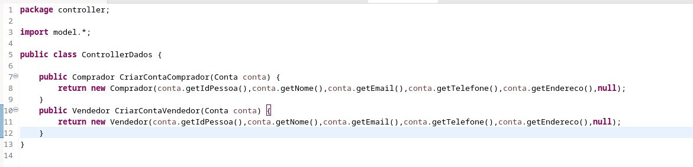
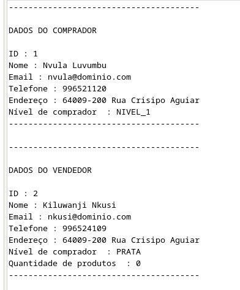
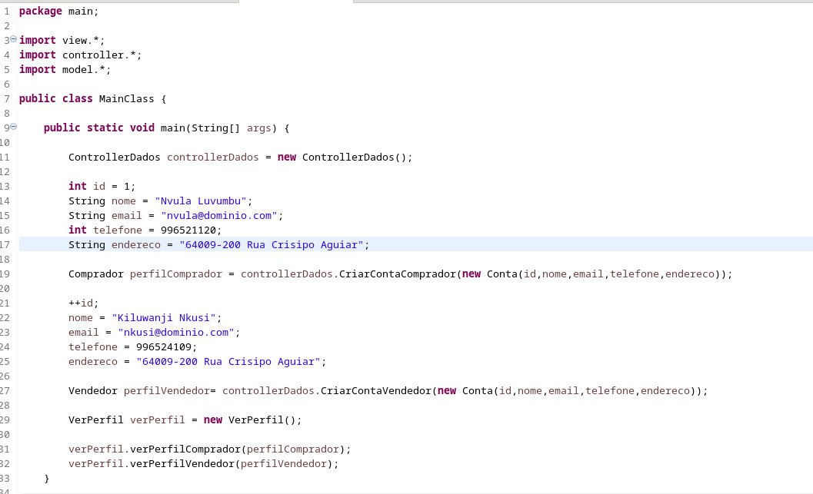
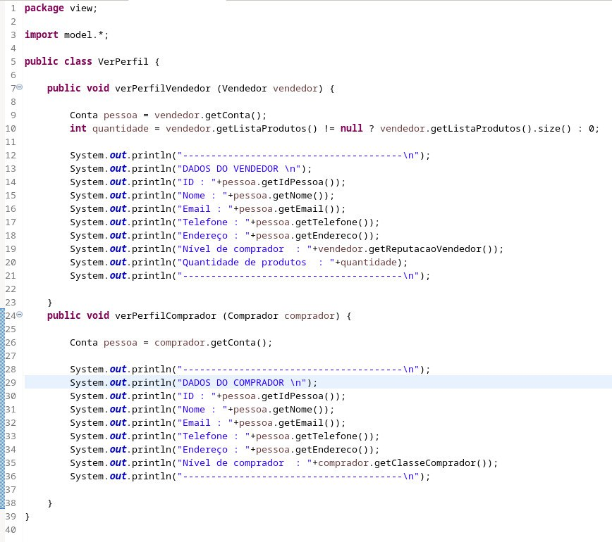

# Reutilização de Software

# Introdução

O termo "arquitetura de reutilização de software" refere-se ao conceito de criar novos sistemas usando módulos ou partes já existentes em vez de começar do zero. Além de facilitar a manutenção e evolução dos sistemas, permite que o desenvolvimento de software seja mais rápido, mais eficiente e com menos probabilidade de erros. A reutilização de software inclui a reutilização de código e arquiteturas e design de sistemas.

# Reutilização no Back-end

Para implementar a reutilização no backend, utilizamos a arquitetura MVC (Model-View-Controller), que foi remodelada e aplicada neste projeto do Mercado Livre. Além disso, desenvolvemos o código de acordo com outros diagramas atualizados, incluindo o diagrama de classes.

A arquitetura MVC é um padrão amplamente utilizado na indústria de desenvolvimento de software. Ela separa a lógica de negócio (Model), a interface com o usuário (View) e o controle das interações entre eles (Controller). Essa separação facilita a reutilização de código, pois permite que diferentes componentes sejam alterados ou substituídos independentemente uns dos outros.

<figcaption align='center'>
    <b>Figura : controladores de dados</b>
     <small>Autores: Erick e Rodolfo</small>
</figcaption>

 

<figcaption align='center'>
    <b>Figura : saída da aplicação</b>
     <small>Autores: Erick e Rodolfo</small>
</figcaption>

 

<figcaption align='center'>
    <b>Figura : código principal </b>
     <small>Autores: Erick e Rodolfo</small>
</figcaption>

 

<figcaption align='center'>
    <b>Figura : main </b>
     <small>Autores: Erick e Rodolfo</small>
</figcaption>

 

## Bibliografia

> DevMedia. Reutilização de Software - Revista Engenharia de Software Magazine 39. Disponível em: <https://www.devmedia.com.br/reutilizacao-de-software-revista-engenharia-de-software-magazine-39/21956>. Acesso em: 09 SET. 2022

Data | Versão |Descrição |Autor | Revisor
-----|--------|----------|------|--------
| 04/07/2023 | 1.0.0 | Elaboração do artefato de reutilização e código | [Vinícius Assumpção](https://github.com/viniman27) , [Gabriel Roger](https://github.com/GabrielRoger07) e [João Pedro Vaz](https://github.com/JoaoPedro0803) | [Erick Levy](https://github.com/Ericklevy) |
