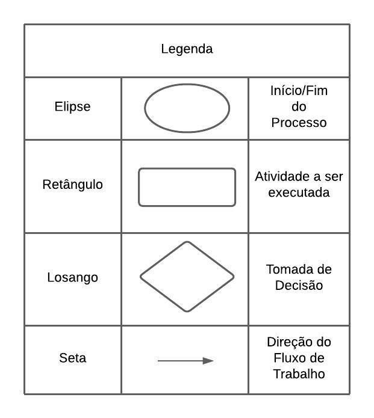
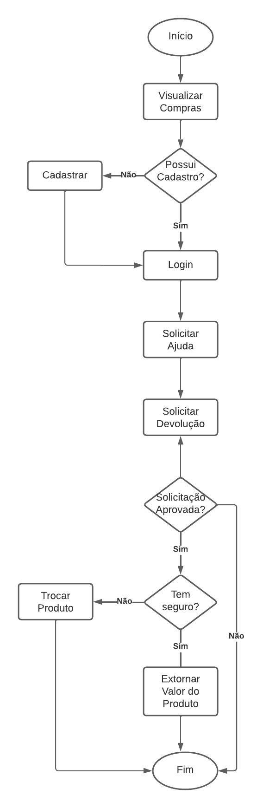
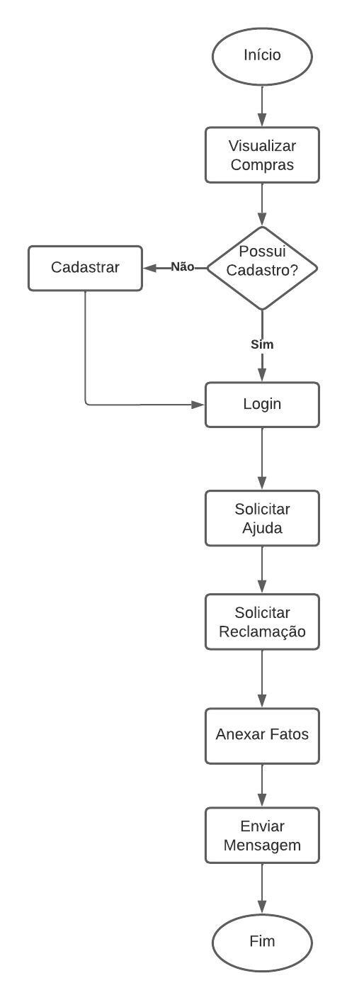

# Artefato Fluxograma

## 1. Introdução

  Um fluxograma consiste em uma ferramenta cuja finalidade é representar, por meio de símbolos gráficos, a sequência e as interações das atividades de
um processo. Tais símbolos proporcionam uma melhor visualização do funcionamento do processo, tornando seu entendimento mais intuitivo. Diante disso, o artefato
consiste em dois fluxogramas referentes aos seguintes processos no sistema Mercado Livre: devolução de um produto e reclamação.

## 2. Metodologia

Como evidenciado, este artefato refere-se a elaboração de fluxogramas. Diante disso, a técnica de fluxograma possui uma série de elementos gráficos, contudo a utilização
ou não desses componentes varia de acordo com a necessidade. Sendo assim, a Figura 1 a seguir evidencia o conjunto de componentes utilizados, assim como sua
nomenclatura e função na aplicação da técnica.

<figcaption align='center'>
    <b>Figura 1 : componentes utilizados para elaboração do fluxograma</b>
     <small>Fonte: Autoria Própria</small>
     <small>Autor: Gustavo Martins Ribeiro</small>
</figcaption>

## Fluxogramas

Após o entendimento da técnica, os artefatos foram elaborados seguindo as regras de confecção e repeitando a forma e lógica de uso dos componentes apresentados
no tópico acima. A seguir, as Figuras 2 e 3 representam, respectivamente, os fluxogramas representando as operações de devolução/estorno e reclamação.

<figcaption align='center'>
    <b>Figura 2: fluxograma do processo de devolução/estorno no sistema Mercado Livre</b>
     <small>Fonte: Autoria Própria</small>
     <small>Autor: Gustavo Martins Ribeiro</small>
</figcaption>

  

<figcaption align='center'>
    <b>Figura 3: fluxograma do processo de reclamação no sistema Mercado Livre</b>
     <small>Fonte: Autoria Própria</small>
     <small>Autor: Gustavo Martins Ribeiro</small>
</figcaption>

## Conclusão

Com o artefato fluxograma em mãos, a equipe têm em mãos mais uma ferramenta capaz de aumentar a qualidade do entendimento sobre os processos modelados, além
do fato de que tal artefato poderá basear a confecção de outros no futuro.

## 5. Referências bibliográficas

* Fluxograma de Processos e seus símbolos gráficos. Disponível em: <https://www.youtube.com/watch?v=HB2bUfhpRqo>. Acesso em: 13 mai. 2023.
* Fluxograma de Processos , como fazer? Disponível em: <https://www.youtube.com/watch?v=xy_W2-ZoIUo> Acesso em: 14 mai. 2023.

