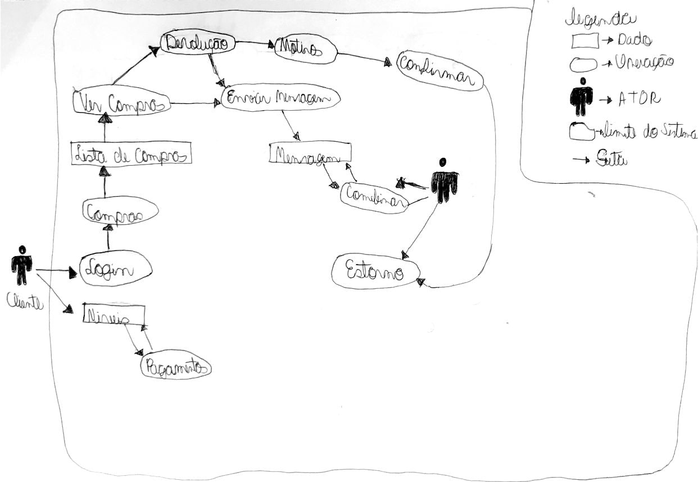
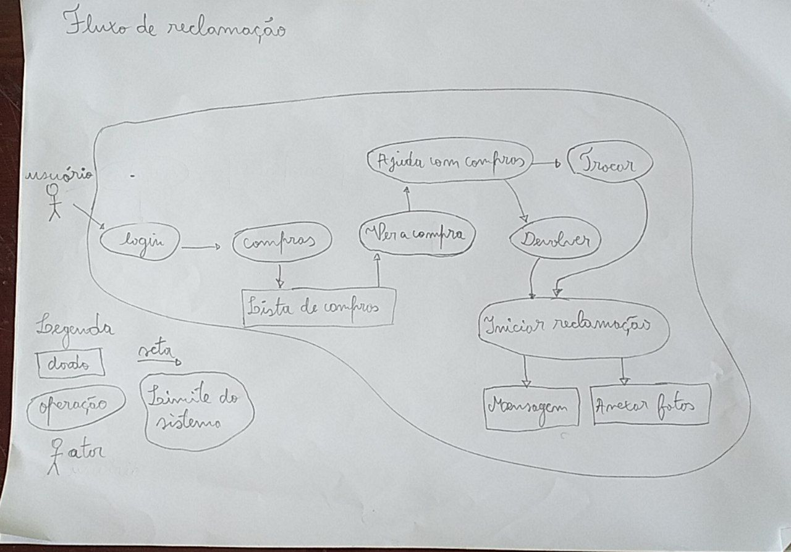

# RichPicture

## 1. Introdução

    Uma rich picture é uma técnica de representação visual que consiste em desenhar uma imagem ou diagrama que explique ou ilustre um problema, situação ou sistema complexo. A técnica de rich picture foi desenvolvida pelo pesquisador britânico Peter Checkland para auxiliar na compreensão e análise de sistemas e organizações complexas.A rich picture geralmente inclui diversos elementos, como pessoas, processos, objetos e interações, e pode ser usada para identificar problemas, desafios, oportunidades e soluções. Essas imagens podem ser utilizadas em diversas áreas, como administração, engenharia, design e pesquisa.

## 2. Objetivo

    O objetivo principal da rich picture é ajudar a compreender e analisar um sistema ou situação complexa, geralmente com múltiplos elementos inter-relacionados. Ao criar uma imagem visual desses elementos, a rich picture pode ajudar a identificar problemas, oportunidades e soluções potenciais.

## 3. Fluxos

    Nesta seção apresentaremos os fluxos da aplicação que nos foram atribuídos, respetivamente. Segue as imagens em anexo. 

### 3.1 Fluxo de devolução e estorno de um produto

<figcaption align='center'>
    <b>Figura 1 : Fluxo de devolução e estorno de um produto</b>
     <small>Fonte: Elaboração Própria</small>
     <small>Autor: Erick Levy</small>
</figcaption>

### 3.2 Fluxo de reclamação

<figcaption align='center'>
    <b>Figura 2 : Fluxo de reclamação</b>
     <small>Fonte: Elaboração Própria</small>
     <small>Autor: Rodolfo Neves</small>
</figcaption>