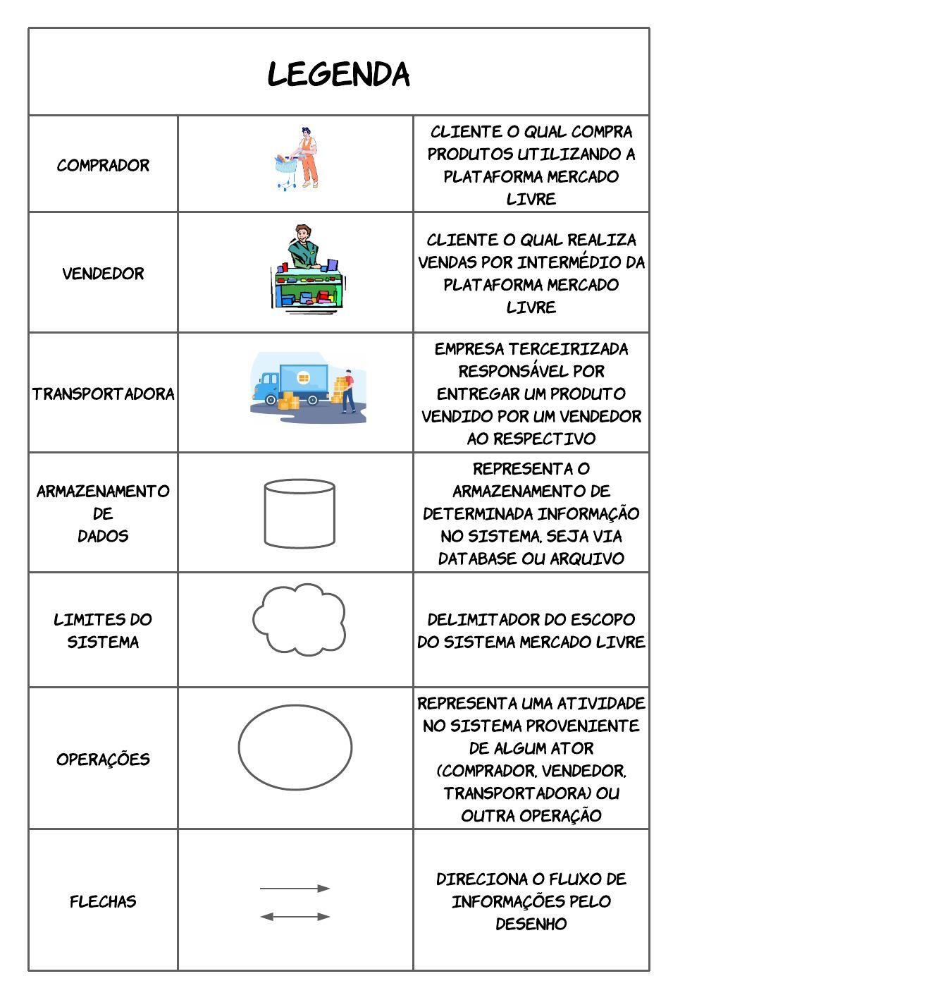
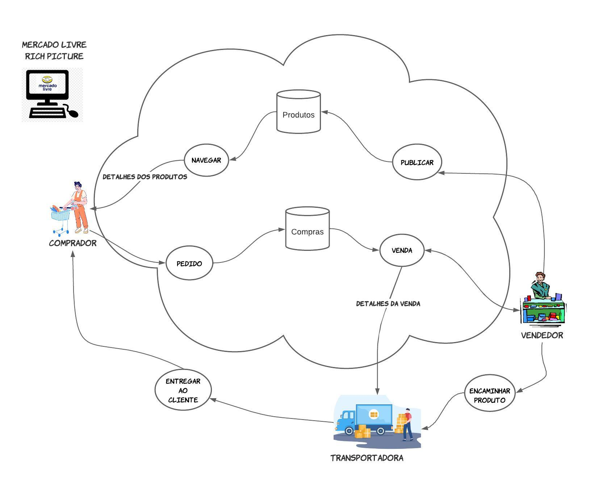

# Artefato Rich Picture

## 1. Introdução

    Uma rich picture é uma técnica pouco formal (ou até mesmo informal) de representação visual desenvolvida pelo pesquisador britânico Peter Checkland para auxiliar na compreensão e análise de sistemas e organizações complexas. Tal ferramenta consiste em desenhar uma "imagem rica" ou diagrama que explique ou ilustre um problema, situação ou sistema complexo, podendo ser feita de primeira mão durante uma conversa com o própio usuário. Diante disso, tal artefato auxilia atividades como a elicitação de requisitos, administração, engenharia, design e pesquisa.

## 2. Objetivo

    O objetivo principal da rich picture é ajudar a compreender e analisar um sistema ou situação complexa, geralmente com múltiplos elementos inter-relacionados. Ao criar uma imagem visual desses elementos, a rich picture pode ajudar a identificar problemas, oportunidades, soluções potenciais e requisitos. 

## 3. Metodologia

    Apesar da informalidade, alguns elementos geralmente são úteis para o desenvolvimento de um bom rich picture. Logo, para o desenvolvimento desse artefato, foi usado o seguinte framework: atores (comprador, vendedor, transportadora), operações, armazenamento de dados, flexas e limite do sistema. Sendo assim, um autor consiste em uma representação de um grupo de usuários ou outro sistema, enquanto uma operação consiste em uma atividade do sistema. Por outro lado, o armazenamento de dados consiste em dados proveniente de um banco de dados ou sistema de arquivos, enquanto as flexas e o limete do sistema remetem, respectivamente, ao fluxo de dados e escopo do sistema principal (Mercado Livre). Tais elementos podem ser visto conforme a Tabela 1 a seguir.

<figcaption align='center'>
    <b>Tabela 1 : componentes genéricos para elaboração de um rich picture</b>
     <small>Fonte: Autoria Própria</small>
     <small>Autor: Gustavo Martins Ribeiro</small>
</figcaption>

    
    
Diante do exposto, a Tabela 2 a seguir sintetiza, com maior detalhamento, os componentes adaptados, os quais foram utilizados na construção do artefato rich picture proposto.

<figcaption align='center'>
    <b>Tabela 1 : componentes adaptados para construção do rich picture</b>
     <small>Fonte: Autoria Própria</small>
     <small>Autor: Gustavo Martins Ribeiro</small>
</figcaption>

### 4 Rich Picture

    A seguir, confira o artefato Rich Picture desenvolvido. Nele, por exemplo, é possível perceber, em alto nível de abstração, a relação entre os usuários, seja comprador ou vendedor, com sistema mercado livre, além do papel das transportadores, empresas especializadas no transporte de mercadorias, no processo de venda.

<figcaption align='center'>
    <b>Figura 1 : rich picture do sistema mercado livre</b>
     <small>Fonte: Autoria Própria</small>
     <small>Autor: Gustavo Martins Ribeiro</small>
</figcaption>

## 4 Conclusão

    Com o artefato Rich Picture em mãos, novos horizontes sobre o funcionamento do sistema surgiram. Diante disso, o projeto acaba possuindo mais uma ferramanta poderosa para auxiliar a equipe de desenvolvimento, aumentando a capacidade de administração, engenharia e conhecimento sobre os requisitos, conforme propunha a técnica em si.

## 5. Referências bibliográficas

* Quando e onde recebo o dinheiro da minha devolução. Disponível em: <https://www.mercadolivre.com.br/ajuda/5266>. Acesso em: 19 abr. 2023.
* Como fazer uma reclamação no Mercado Livre? Disponível em: <https://www.tecmundo.com.br/internet/220659-fazer-reclamacao-mercado-livre.htm>. Acesso em: 20 abr. 2023.
* Rich Pictures. Disponível em: <http://systems.open.ac.uk/materials/T552/pages/rich/richAppendix.html> 
* MANK, Andrew; HOWARD, Steve. The Rich Picture: A Tool for Reasoning About Work Context. Oxford, 1998.
* Software Development Project. Introducing Rich Pictures. Disponível em: <https://aprender3.unb.br/pluginfile.php/2523045/mod_resource/content/2/1_5145791542719414573.pdf>

REVADI, Chindy. CTEC2402 Rich Picture Guidelines.

‌ 
## 5. Versionamento

| Versão | Data da realização | Data prevista revisão | Descrição | Autor | Revisor |
|--------|------|------|-----------|-------|---------|
| 1.0    | 23/04/2023 | 19/04/2023 | Criação do documento oficial | [Erick Levy](https://github.com/Ericklevy)   | [Rodolfo Neves](https://github.com/roddas) |
| 1.1    | 23/04/2023 | 19/04/2023 | Adição dos fluxos | [Rodolfo Neves](https://github.com/roddas)  e  [Erick Levy](https://github.com/Ericklevy) | [Gustavo Martins](https://github.com/gustavomartins-github) , [Vinícius Assumpção](https://github.com/viniman27)  e  [Lucas Rodrigues](https://github.com/nickby2)  |
| 2 | 13/05/2023 | 15/05/2023 | Adição da nova versão do Rich Picture | [Gustavo Martins](https://github.com/gustavomartins-github) | [Lucas Rodrigues](https://github.com/nickby2)
