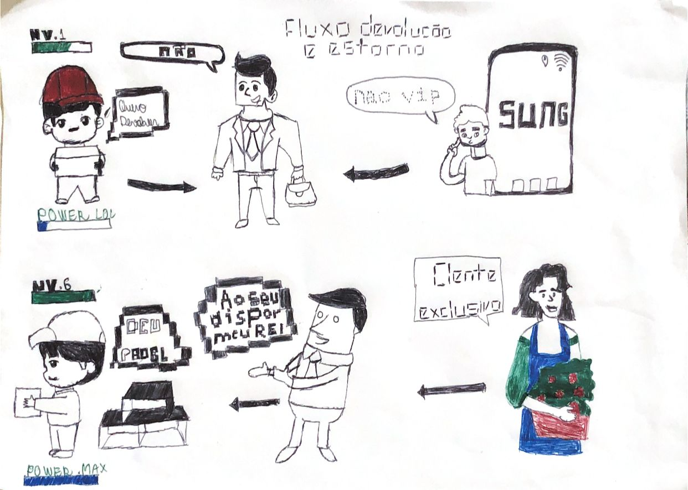

# StoryBoard

## 1. Introdução

    O storyboard é uma ferramenta essencial para planejar e pré-visualizar projetos criativos, como filmes, animações e jogos eletrônicos. Ele é composto por uma sequência de desenhos e anotações que descrevem as cenas, ações, diálogos, movimentos de câmera e efeitos especiais necessários para o projeto.Criado antes da produção, o storyboard serve como um guia para a equipe de produção, ajudando a entender a estrutura do projeto e a determinar a ordem dos eventos, além de planejar as diferentes etapas da produção. Também é uma ferramenta importante para comunicação com os investidores, permitindo que eles tenham uma ideia clara de como o projeto final ficará.

## 2. objetivo

    O objetivo do storyboard no Scrum é facilitar a comunicação e a colaboração entre a equipe , permitindo que todos tenham uma visão clara do andamento do projeto. Além disso, ele ajuda a equipe a entender as prioridades do projeto e a determinar o que deve ser feito a seguir.

## 3 . Esboço

    O esboço é um estágio inicial e importante na criação de um storyboard, pois permite que o criador tenha uma visão geral do projeto e esboce ideias para as cenas e eventos que serão representados no storyboard. Ao criar um esboço, o criador pode explorar diferentes opções e experimentar ideias sem se preocupar com detalhes, o que ajuda a desenvolver conceitos mais completos e refinados.

<figcaption align='center'>
    <b>Figura 1 : Esboço para confecção de artefatos</b>
     <small>Fonte: Elaboração Própria</small>
     <small>Autor: Erick Levy</small>
</figcaption>

## 4 .Storyboard

    A história narra a experiência de um jovem chamado Pedro que gostava de fazer compras online na plataforma do Mercado Livre. Ao comprar um celular usado, ele percebeu que havia problemas com o dispositivo e decidiu devolvê-lo. Porém, como um cliente nível 1, ele teve que esperar mais tempo para o processamento da devolução e recebeu apenas uma parte do valor total do produto. Pedro aprendeu que, ao se envolver ativamente na plataforma, os clientes podem receber um melhor tratamento e evitar surpresas desagradáveis. Além disso, a história destaca a importância de verificar cuidadosamente os produtos antes de fazer a compra.

<figcaption align='center'>
    <b>Figura 2 : StoryBoard sobre Devolução e Estorno</b>
     <small>Fonte: Elaboração Própria</small>
     <small>Autor: Erick Levy</small>
</figcaption>

## 4. Conclusão

    Concluímos que a partir desse documento podemos ter uma visão inicial das tarefas que serão mais detalhadas no documento de <a href="https://unbarqdsw2023-1.github.io/2023.1_G3_ProjetoMercadoLivre/#/Base/DesignSprint" > Rich Picture </a> Além disso, o storyboard pode ajudar a garantir a consistência visual e a coerência narrativa na rica imagem. Isso é particularmente importante quando se trabalha em equipe, pois ajuda a garantir que todos os envolvidos tenham uma compreensão clara e consistente da narrativa representada.

## 5. Referências

> Preece, J.; Rogers, Y.; Sharp, H.; Design de Interação. Além da Interação Homem-Computador.

* Quando e onde recebo o dinheiro da minha devolução. Disponível em: <https://www.mercadolivre.com.br/ajuda/5266>. Acesso em: 19 abr. 2023.
* Como fazer uma reclamação no Mercado Livre? Disponível em: <https://www.tecmundo.com.br/internet/220659-fazer-reclamacao-mercado-livre.htm>. Acesso em: 20 abr. 2023.

* Fontes pixeladas. Disponível em: <https://fontmeme.com/pt/fontes-pixeladas/> . Acesso em: 21 abri. 2023.
 

## 6. Versionamento

|Data | Versão | Descrição | Autor(es)|Revisores|
| -- | -- | -- | -- |--|
| 24/04/2023 | 1.0 | Criação do documento | [Erick Levy](https://github.com/Ericklevy) | [Vinícius Assumpção](https://github.com/viniman27) e [Gian medeiros](https://github.com/GianMedeiros)  | 

