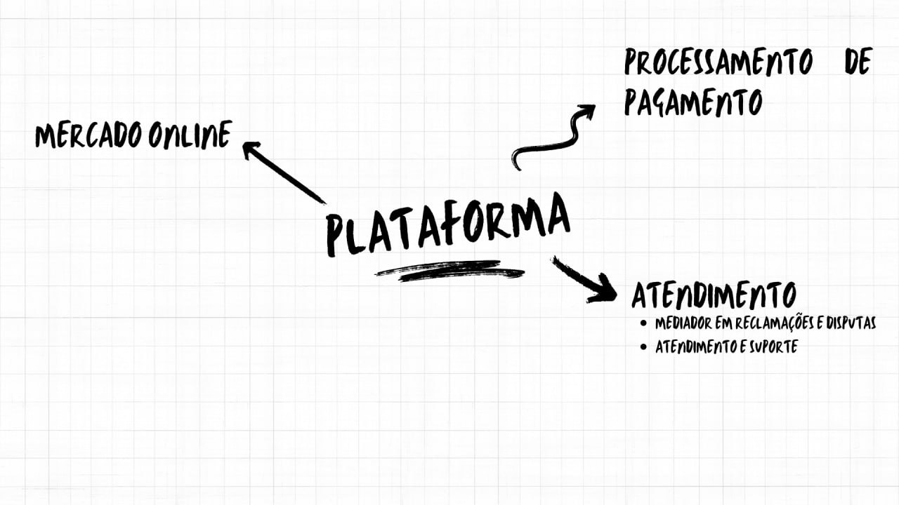

# 
 Mapa Mental

## Metodologia
 

O Mapa Mental é uma ferramenta que permite a organização de seu conteúdo de maneira harmônica com os processos cognitivos, ou seja, a disposição dos elementos é feita da mesma forma como ocorre em nosso cérebro, facilitando a memorização e a compreensão do que está escrito. O Mapa Mental contribui para a solução de problemas, uma vez que ajuda a visualizar e diagnosticar todos os aspectos e consequências de uma situação, criando um panorama que possibilita o melhor entendimento da mesma. O diagrama conta com vários recursos como cores, símbolos e, principalmente, uma estrutura que prevê como elemento central a ideia, tarefa ou conceito que seja a palavra-chave para o tema em questão e suas ramificações, associando uma informação a outra.

 

## Mapa Mental
 

### Diagrama Geral

O diagrama abaixo explicita as ideias da equipe acerca do tema escolhido para o projeto, as quais serviram como insumos para elicitação dos requisitos.

 
  <iframe width="768" height="432" src="https://miro.com/app/live-embed/uXjVMQTERbA=/?moveToViewport=-3156,-1300,4608,2306&embedId=975132118008" frameborder="0" scrolling="no" allow="fullscreen; clipboard-read; clipboard-write" allowfullscreen></iframe>
<figcaption align='center'>
  <b>Figura 1: Mapa Mental</b>
   
  <small>Autoria: Grupo 3</small>
</figcaption>
 

### Artefatos do MapaMental

O mapa mental é dividido em vários diagramas menores, cada um dos quais se concentra em um aspecto particular do tópico para melhor entendimento do projeto.

#### Mercado Livre

 

 
 
<figcaption align='center'>
  <b>Figura 2: Mapa Mental(Mercado livre)</b>
   
  <small>Autoria: Grupo 3</small>
</figcaption>
 

#### Comprador

 

 
 
<figcaption align='center'>
  <b>Figura 3: Mapa Mental(Comprador )</b>
   
  <small>Autoria: Grupo 3</small>
</figcaption>
 

#### Devolução

 

 
 
<figcaption align='center'>
  <b>Figura 4: Mapa Mental-Comprador</b>
   
  <small>Autoria: Grupo 3</small>
</figcaption>
 

#### Reclamação

 

 
 
<figcaption align='center'>
  <b>Figura 5: Mapa Mental-Reclamação</b>
   
  <small>Autoria: Grupo 3</small>
</figcaption>
 

#### Estorno

 

 
 
<figcaption align='center'>
  <b>Figura 6: Mapa Mental-Estorno</b>
   
  <small>Autoria: Grupo 3</small>
</figcaption>
 

#### plataforma

 

 
 
<figcaption align='center'>
  <b>Figura 7: Mapa Mental-plataforma</b>
   
  <small>Autoria: Grupo 3</small>
</figcaption>
 

#### Vendedor

 

 
 
<figcaption align='center'>
  <b>Figura 8: Mapa Mental-Vendedor</b>
   
  <small>Autoria: Grupo 3</small>
</figcaption>
 

## Referências
 

SERRANO, Milene. **Mapa Mental**, 2021. Material apresentado na Disciplina de Arquitetura e Desenho de Software do curso de engenharia de software da UnB, FGA. Acesso em: 8 de fevereiro de 2021

SBCOACHING. **Mapa Mental: O que é e Como Fazer**. Disponível em: [https://www.sbcoaching.com.br/blog/mapa-mental/](https://www.sbcoaching.com.br/blog/mapa-mental/) Acesso em: 8 de fevereiro de 2021.

BrainStorming,**Mercado Livre** .Disponivel em :[https://unbarqdsw2023-1.github.io/2023.1_G3_ProjetoMercadoLivre/#/Base/eliticacao/Brainstorming](https://unbarqdsw2023-1.github.io/2023.1_G3_ProjetoMercadoLivre/#/Base/eliticacao/Brainstorming)

## Histórico de versionamento 
|Data | Versão | Descrição | Autor(es)|Revisores|
| -- | -- | -- | -- |--|
| 22/04/2023 | 1.0 | Criação do documento |[Abdul Hannan](https://github.com/hannanhunny01) ,   [Lucas Rodrigues](https://github.com/nickby2) e  [Kathlyn Lara](https://github.com/klmurussi)    | [Erick Levy](https://github.com/Ericklevy) | 
