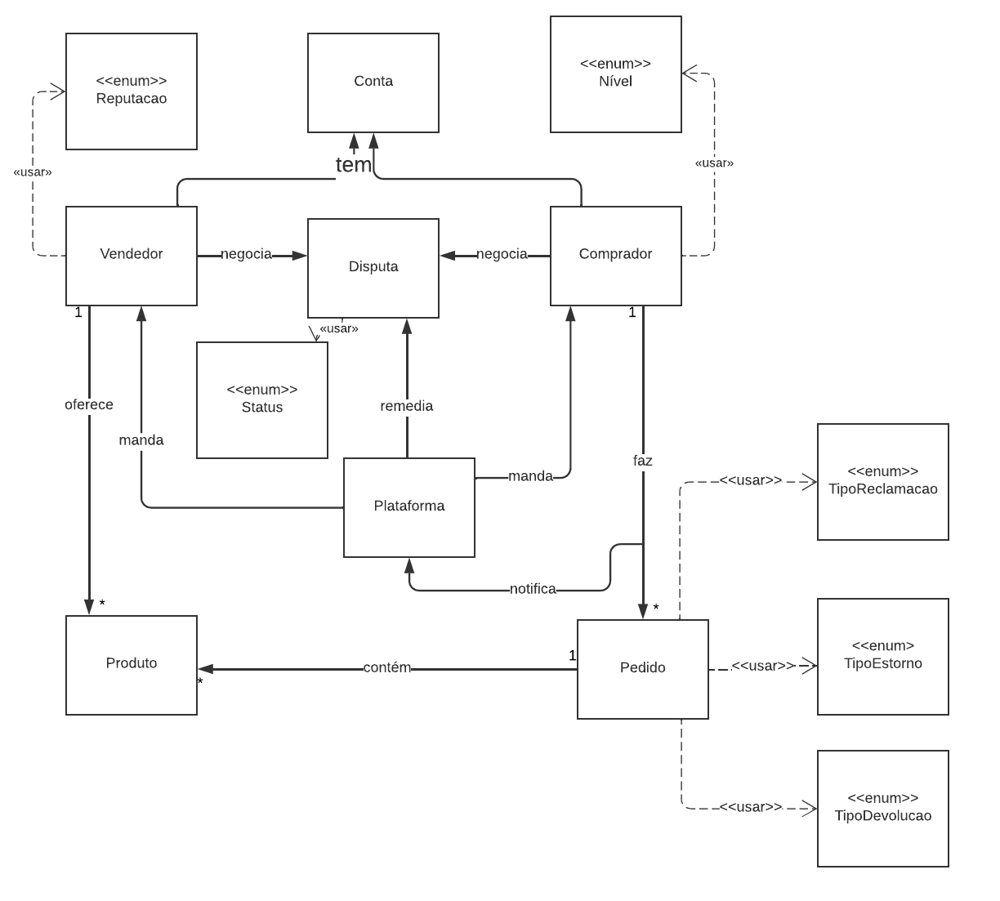

# Artefato Diagrama de Classes

## 1. Introdução
O Diagrama de Classes é uma ferramenta visual utilizada na modelagem de sistemas orientados a objetos. Ele descreve a estrutura estática, baseada no padrão UML, de um sistema, representando suas classes, atributos, métodos e relacionamentos. Diante disso, o objetivo principal desta ferramenta consiste em fornecer uma modelagem clara e concisa das entidades que compõem um sistema.

## 2. Metodologia
Nesse diagrama, as classes são representadas por retângulos, que contêm o nome da classe no topo e, internamente, os atributos e métodos associados. Os relacionamentos entre as classes são representados por linhas, que podem indicar associações, agregações, composições, heranças, entre outros. Esses relacionamentos são fundamentais para entender a inter-relação entre as classes, assim como a interação dessas classes com o sistema em si.

## 3. Diagrama de Classes
 Conforme propunha este artefato, a imagem 1 a seguir expressa o resultado do desenvolvimento do diagrama de classes, contudo de forma compactada para facilitar a visualização. Por outro lado, a versão expandida pode ser encontrada [clicando aqui](https://lucid.app/lucidchart/a53dd78b-4cc5-443a-9448-48a2df2695d2/edit?viewport_loc=-284%2C-48%2C4440%2C1916%2C.7.W52qyyi8y&invitationId=inv_70e52ed6-fa8c-457d-ac8d-1d17809f36ae), a fim de se obter mais detalhes. Tal contexto deve-se ao "porte" do artefato, o qual possui um tamanho relativamente grande, conforme o porte do sistema Mercado Livre.

<figcaption align='center'>
    <b>Figura 1 : diagrama de classes do sistema Mercado Livre</b>
     <small>Fonte: Elaboração Própria</small>
     <small>Autor: Kathlyn Murussi</small>
</figcaption>

## 4. Conclusão
  Por meio do desenvolvimento do artefato Diagrama de Classes, assim como o resultado final, o projeto evolui no que tange ao conhecimento sobre os elementos mais importantes do sistema Mercado Livre. Sendo assim, tal artefato, além de enrriquecer o projeto, poderá servir de base para outros artefatos futuros.

## 5. Referências
SERRANO, Milene. DSW-Modelagem - Diagrama de Classe, 2020. Material apresentado na Disciplina de Arquitetura e Desenho de Software do curso de Engenharia de Software da UnB, FGA [Video Aula]. Acesso em: 14 de maio de 2023.

ALVES, Nelio. Programação Orientada a Objetos com Java: Enumerações, Composição [Curso online]. Recuperado de http://educandoweb.com.br. Acesso em: 14 de maio de 2023.

## Histórico de Versões

| Versão | Data da realização | Data prevista revisão | Descrição | Autor | Revisor |
|--------|------|------|-----------|-------|---------| 
| 1.0 | 14/05/2023 | 15/05/2023 | Criação do artefato | [Kathlyn Murussi](https://github.com/klmurussi) | [Gustavo Martins Ribeiro](https://github.com/gustavomartins-github) e [Gian Medeiros](https://github.com/GianMedeiros) |

