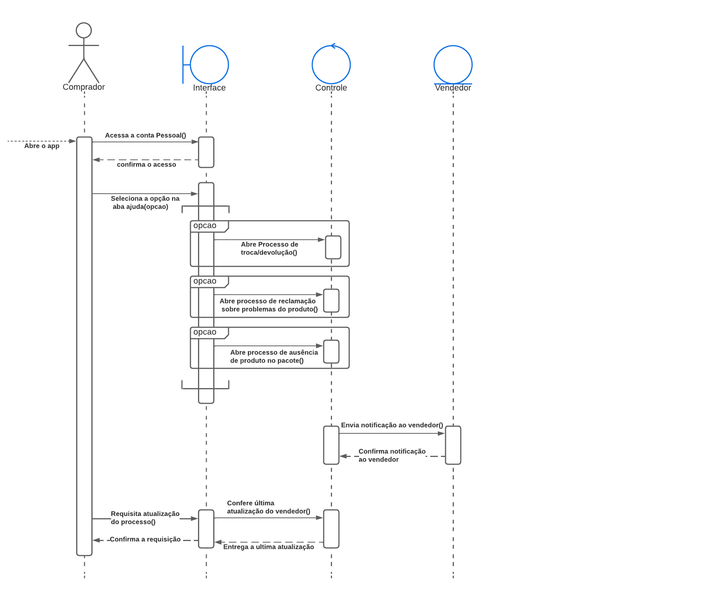
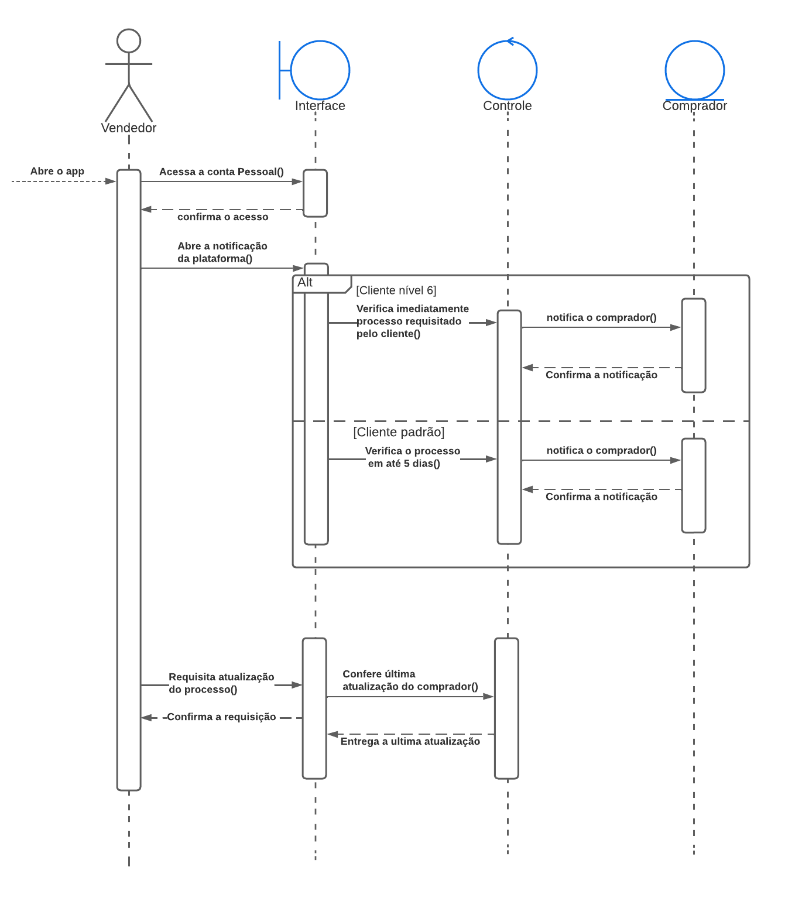

# Diagrama de Sequência

## Introdução

O Diagrama de Sequência modela as interações entre objetos em um caso de uso. Ilustra como diferentes partes do sistema interagem entre si para realizar determinada função, além da ordem que as interações ocorrem quando um caso de uso é executado.

## Metodologia 
A partir de reuniões realizadas entre a equipe do projeto foram identificadas as interações entre os objetos do sistema. Após isto, o diagrama de sequência foi elaborado, com o intuito de mapear a jornada do usuário ao utilizar o produto que será desenvolvido, assim pudemos obter uma visão geral de alto nível das funcionalidades específicas do produto.

## Notações

É estruturado de forma que representa uma linha de tempo que começa no topo e desce gradualmente para marcar uma sequência de interações. Cada objeto tem uma coluna e as mensagens são trocadas por setas.

### Linha de vida

É exibida em um diagrama de sequência e é exibida com seu nome e tipo em um retângulo, que é chamado cabeça. A cabeça está localizada no topo de uma linha tracejada vertical, que representa o tempo da instância do objeto.

Quando possui um símbolo de ator é usada quando o diagrama de sequência pertence a um caso de uso.

### Entidade

Representa os dados do sistema. Por exemplo, uma aplicação de restaurante, a entidade Funcionário administraria todos os dados relacionados as mesas.

### Interface

Tela de interface entre sistema e usuário.

### Control

Organiza e programa as interações entre os limites e entidades e serve como mediador deles.

### Barras de Ativação

É usada para indicar que um objeto está ativo (ou instanciado) durante uma interação entre dois objetos. No caso do diagrama de sequência, quando um objeto envia uma mensagem para outro.

### Mensagem

Pode fluir em qualquer direção e pode-se descrever a mensagem que está passando. Com cada tipo de seta você pode indicar o tipo de mensagem que está sendo enviada ou recebida.

## Diagramas

# Diagrama de sequência do comprador

<figcaption align='center'>
  <b>Figura 1: Diagrama de sequência do comprador, versão 1</b>
   
  <small>Fonte: Grupo 3</small>
</figcaption>
 

# Diagrama de sequência do vendedor

<figcaption align='center'>
  <b>Figura 2: Diagrama de sequência do vendedor, versão 1</b>
   
  <small>Fonte: Grupo 3</small>
</figcaption>
 

## Referências

SERRANO, Milene. Diagrama de Colaboração, 2022. Material apresentado na Disciplina de Arquitetura e Desenho de Software do curso de engenharia de software da UnB, FGA. Acesso em: 09 de maio 2023.

Linhas de Vida em Diagramas UML. Disponível em: https://www.ibm.com/docs/pt-br/rsm/7.5.0?topic=diagrams-lifelines-in-uml. Acesso em: 09 de maio 2023.

Tutorial do Diagrama de Sequência: Guia completo com exemplos. Disponível em: https://creately.com/blog/pt/diagrama/tutorial-do-diagrama-de-sequencia/. Acesso em: 09 de maio 2023.

## Histórico de Versionamento

| Data | Versão | Descrição | Autor | Revisor | 
| -----|--------|----------|------|-------- |
| 09/05/2023 | 1.0.0 | Elaboração do artefato de Diagrama de Atividades e adição da primeira versão dos diagramas | [Vinicius Assumpção](https://github.com/viniman27) | [Erick Levy](https://github.com/Ericklevy)  |
| 12/05/2023 | 1.0.1 | Inclusão de fonte e legenda nas imagens | [Gabriel Roger](https://github.com/GabrielRoger07) ,  [João Pedro Vaz](https://github.com/JoaoPedro0803) e [Vinicius Assumpção](https://github.com/viniman27) | [Erick Levy](https://github.com/Ericklevy), [Rodolfo Neves](https://github.com/roddas), [Kathlyn Lara](https://github.com/klmurussi), [Gian medeiros](https://github.com/GianMedeiros), [Lucas Rodrigues](https://github.com/nickby2)|
