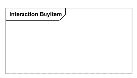

# Diagrama de Colaboração/Comunicação

## Introdução

<p align='justify' > Diagrama de comunicação, também conhecido como diagrama de colaboração, na versão <span font-style='italic'>1.x</span> é um tipo de diagrama de interação UML que apresenta interações entre objetos e/ou partes utilizando mensagens sequenciadas num arranjo de forma livre. o mesmo corresponde a um diagrama de sequência simples sem mecanismos de estruturas como uso de interações e fragmentos combinados.</p>

## Metodologia

Este mesmo diagrama é composto por vários elementos, dentre os quais:

* Quadro *(ou frame)*
* Lifeline
* Mensagem

### Quadro *(ou frame)*

<p align='justify' >Diagramas de comunicação devem ser apresentados dentro de um quadro retangular com o nome, num compartimento no canto superior esquerdo. Não existe um formato longo específico para tipo de cabeçalho de diagramas de comunicação. A forma longa do nome de forma longa <span font-weight='bold' >interaction</span> pode ser utilizado. </p>
<p align='justify' >
</p>




<figcaption align='center'>
    <p>Figura 1: Quadro de interação para o diagrama de comunicação BuyItem</p>
    <p>Fonte: KIRILL FAKHROUTDINOV. UML communication diagrams overview - graphical notations for lifeline, message, etc. Disponível em: [https://www.uml-diagrams.org/communication-diagrams.html](https://www.uml-diagrams.org/communication-diagrams.html)</p>
</figcaption>


<p align='justify' >Não existe também uma forma nominal curta para diagramas de comunicação. Uma forma nominal curta, denominada <span font-weight='bold'>sd</span> (que é utilizada para diagramas em geral) pode ser utilizada. </p>


<figcaption align='center'>
    <p>Figura 2: Quadro de interação para o diagrama de comunicação BuyItem, na forma curta.</p>
    <p>Fonte: KIRILL FAKHROUTDINOV. UML communication diagrams overview - graphical notations for lifeline, message, etc. Disponível em: [https://www.uml-diagrams.org/communication-diagrams.html](https://www.uml-diagrams.org/communication-diagrams.html)</p>
</figcaption>

### Lifeline

<span font-style='italic' ></span>
<p align='justify'>
Lifeline é uma especialização do elemento nomeado que representa um participante individual na interação. Embora as peças e os recursos estruturais possam ter multiplicidade maior que 1, as linhas de vida representam apenas uma entidade em interação.

Se o elemento conectável referenciado for multivalorado (ou seja, tiver uma multiplicidade > 1), então a linha de vida pode ter uma expressão (seletor) que especifica qual parte específica é representada por essa linha de vida. Se o seletor for omitido, isso significa que um representante arbitrário do elemento conectável multivalorado é escolhido.

Uma linha de vida é mostrada como um retângulo (correspondente à "cabeça" nos diagramas de sequência). Linha de vida em diagramas de sequência tem "cauda" representando a linha de vida, enquanto "linha de vida" no diagrama de comunicação não tem linha, apenas "cabeça".</p>

As informações que identificam o lifeline são exibidas dentro do retângulo no seguinte formato:

```
lifeline-ident ::= ([ connectable-element-name [ '[' selector ']' ] ] [: class-name ] [decomposition] )  | 'self'
selector ::= expression
decomposition ::= ‘ref’ interaction-ident [ 'strict' ]
```
Onde **class-name** é o tipo referenciado pelo elemento conectável representado. Observe que, embora a sintaxe permita, lifeline-ident não pode estar vazio.


<figcaption align='center'>
    <p>Figura 3 : Lifeline anônima da classe User.</p>
    <p>Fonte: KIRILL FAKHROUTDINOV. UML communication diagrams overview - graphical notations for lifeline, message, etc. Disponível em: [https://www.uml-diagrams.org/communication-diagrams.html](https://www.uml-diagrams.org/communication-diagrams.html)</p>
</figcaption>


<figcaption align='center'>
    <p>Figura 4 : Lifeline x da classe K é selecionada com o seletor [k]</p>
    <p>Fonte: KIRILL FAKHROUTDINOV. UML communication diagrams overview - graphical notations for lifeline, message, etc. Disponível em: [https://www.uml-diagrams.org/communication-diagrams.html](https://www.uml-diagrams.org/communication-diagrams.html)</p>
</figcaption>

<p align='justify'>
Se o nome for a palavra-chave self, então o lifeline representa o objeto do classificador que inclui a interação que possui a linha de vida. As portas do invólucro podem ser mostradas separadamente, mesmo quando o auto estiver incluído.
</p>

### Mensagem

A mensagem no diagrama de comunicação é mostrada como uma linha com uma expressão de sequência e uma seta acima da linha. A seta indica a direção da comunicação.


<figcaption align='center'>
    <p>Figura 5 : A instância da classe A envia a mensagem remove() para a instância de B se s1 for igual a s2</p>
    <p>Fonte: KIRILL FAKHROUTDINOV. UML communication diagrams overview - graphical notations for lifeline, message, etc. Disponível em: [https://www.uml-diagrams.org/communication-diagrams.html](https://www.uml-diagrams.org/communication-diagrams.html)</p>
</figcaption>


#### Expressão de Sequência

A expressão de sequência é uma lista separada por pontos de termos de sequência seguido por dois pontos (":") e o nome da mensagem depois disso:
```
expressão-sequência ::= termo-sequência '.' . . . ':' nome da mensagem
```
Por exemplo, **3b.2.2:m5** contém a expressão de sequência **3b.2.2** e o nome da mensagem **m5**.


## Diagrama de Comunicação do Mercado Livre


<figcaption align='center'>
    <p>Figura 6 : Diagrama de Comunicação do de um determinado fluxo da plataforma Mercado Livre</p>
    <p>Fonte: Própria</p>
</figcaption>

## Referências

* KIRILL FAKHROUTDINOV. UML communication diagrams overview - graphical notations for lifeline, message, etc. Disponível em: [https://www.uml-diagrams.org/communication-diagrams.html](https://www.uml-diagrams.org/communication-diagrams.html).

## Histórico de versão

| Data | Versão | Descrição | Autor | Revisor |
| ---- | ------ | --------- | ----- | ------- |
| 13/05/2023 | 1.0 | Criação do documento inicial | [Rodolfo Cabral Neves](https://github.com/roddas) | [Erick Levy](https://github.com/Ericklevy/) |
| 13/05/2023 | 1.1 | Criação do diagrama de comunicação do mercado livre | [Lucas Rodrigues Monteiro](https://github.com/nickby2) | [Kathlyn Lara Murussi](https://github.com/klmurussi/) |
| 13/05/2023 | 1.2 | Adição da legenda da última figura | [Rodolfo Cabral Neves](https://github.com/roddas) | [Erick Levy](https://github.com/Ericklevy/) |
| 13/05/2023 | 1.2 | Adição da legenda da última figura | [Lucas Rodrigues Monteiro](https://github.com/nickby2) | [Erick Levy](https://github.com/Ericklevy/) |
