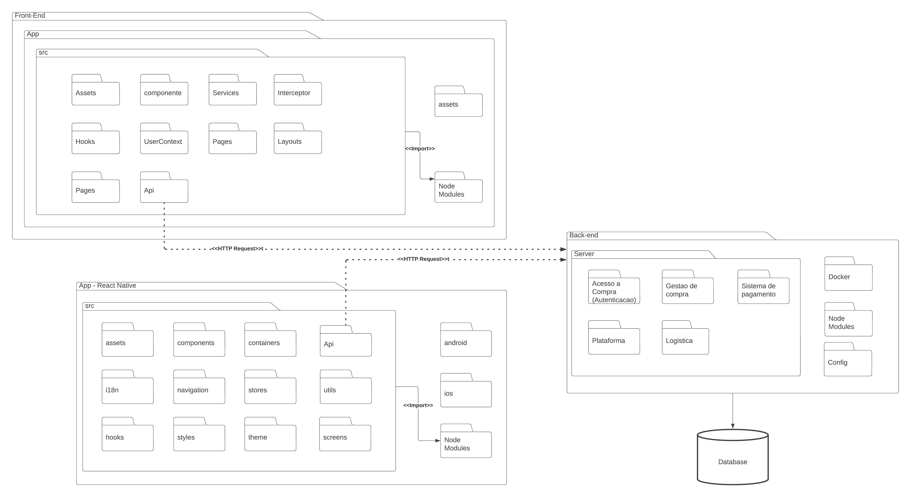

# Diagrama de Pacotes

## 1. Introdução

O diagrama de pacotes é uma ferramenta de modelagem utilizada em engenharia de software para representar a estrutura de pacotes e subpacotes em um sistema. Ele é útil para organizar e visualizar a estrutura de um sistema complexo e seus componentes.

Em um diagrama de pacotes, os pacotes são representados como caixas retangulares, com seus nomes escritos dentro delas. Os subpacotes são mostrados como caixas menores dentro do pacote principal. As dependências entre os pacotes são representadas por linhas que conectam as caixas, indicando como os pacotes estão relacionados.

Por exemplo, em um sistema de comércio eletrônico, o diagrama de pacotes pode incluir pacotes para gerenciamento de usuários, gerenciamento de produtos, carrinhos de compras, pagamentos, envios, avaliações, entre outros. Cada um desses pacotes pode conter subpacotes com classes ou componentes específicos que realizam as funcionalidades relacionadas ao pacote principal.

## 2. metodologia

    Para elaborar este documento os integrantes do grupo realizaram uma reunião por meio do Discord, onde apresentaram cada etapa do processo e demonstraram o que havia sido feito no Lucidchart e pensamos como seria a determinação dos pacotes nas camadas de divisão de software como front back no projeto mercado livre. Após avaliação e discussão em relação às diretrizes do Mercado Livre, o grupo concordou que o trabalho estava finalizado. Além disso, os integrantes se comunicaram e se verificaram por meio do Telegram para garantir a qualidade do trabalho.

## 3. Resultados

<figcaption align='center'>
    <b>Figura : Diagrama de Pacotess</b>
     <small>Fonte: Elaboração Própria</small>
     <small>Autores: Abdul Hannan ,Erick Levy e Heitor Marques</small>
</figcaption>
 
 

## 4. Participantes

- [Abdul Hannan](https://github.com/hannanhunny01)

- [Erick Levy](https://github.com/Ericklevy)

- [Heitor Marques](https://github.com/heitormsb)

## 5. Referências

Documentação UML da OMG em português: A Organização de Modelagem de Objetos (OMG) disponibiliza uma versão traduzida da documentação oficial sobre UML, que inclui informações sobre diagramas de componentes. Você pode acessar o material em: https://www.omg.org/spec/UML/2.5/PDF/ Acesso em: 12 de maio de 2023.

[Lucidchart - Página Principal](https://www.lucidchart.com/pages/?gspk=eXVsaWFzYWRvdmExOTMz&gsxid=kYBpGkxU1XWV&pscd=try.lucid.co&sid=3CelFZqZJbPzD05cQdLVXoKoMG9zXFuah1JlSyx9uaYSFt) 

[YouTube - Vídeo sobre Diagrama de Pacotes](https://www.youtube.com/watch?v=o4srs54NciI) 

## 6. Histórico de versionamento

|Data | Versão | Descrição | Autor(es)|Revisores|
| -- | -- | -- | -- |--|
|15/05/2023|1.0|Criação do Diagrama de Componentes| [Abdul Hannan](https://github.com/hannanhunny01), [Erick Levy](https://github.com/Ericklevy) e [Heitor Marques](https://github.com/heitormsb)| [Kathlyn Murussi](https://github.com/klmurussi), [Gian medeiros](https://github.com/GianMedeiros), [Lucas Rodrigues](https://github.com/nickby2), [Vinícius Assumpção](https://github.com/viniman27) e [Gustavo Martins](https://github.com/gustavomartins-github) |