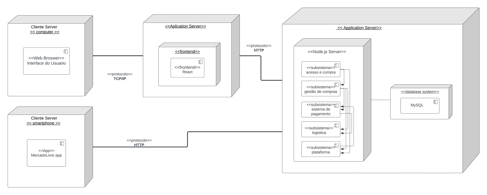

# Diagrama de Implantação

## 1. Introdução

    O diagrama de implantação é uma ferramenta de modelagem utilizada em engenharia de software para representar a arquitetura física de um sistema. Ele mostra como os componentes do sistema são implantados em hardware e software específicos.

    Em um diagrama de implantação, os nós físicos são representados por caixas e os componentes do sistema são mostrados como objetos. As setas indicam as relações entre os componentes e os nós físicos, indicando onde cada componente está sendo executado e como ele se comunica com outros componentes ou usuários.

    Por exemplo, em um sistema de comércio eletrônico, o diagrama de implantação pode incluir nós físicos, como servidores de aplicativos, servidores de banco de dados, firewalls, balanceadores de carga, etc. Os componentes do sistema, como o servidor web, o servidor de banco de dados e o servidor de pagamento, são mostrados como objetos, indicando em qual nó físico eles estão sendo executados.

## 2. metodologia

    Para elaborar este documento e o diagrama de implantação, primeiramente finalizamos o diagrama de componentes para modelar este novo diagrama de acordo com o que foi feito. Os integrantes do grupo realizaram uma reunião por meio do Discord, onde apresentaram cada etapa do processo e demonstraram o que havia sido feito no Lucidchart. Após avaliação e discussão em relação às diretrizes do Mercado Livre, o grupo concordou que o trabalho estava finalizado. Além disso, os integrantes se comunicaram e se verificaram por meio do Telegram para garantir a qualidade do trabalho.

## 3. Resultados

<figcaption align='center'>
    <b>Figura : Diagrama de Implantação</b>
     <small>Fonte: Elaboração Própria</small>
     <small>Autores: Abdul Hannan ,Erick Levy e Heitor Marques</small>
    
</figcaption>
 

## 4. Participantes

- [Abdul Hannan](https://github.com/hannanhunny01)

- [Erick Levy](https://github.com/Ericklevy)

- [Heitor Marques](https://github.com/heitormsb)

## 5. Histórico de versionamento

|Data | Versão | Descrição | Autor(es)|Revisores|
| -- | -- | -- | -- |--|
|15/05/2023|1.0|Criação do Diagrama de Componentes| [Abdul Hannan](https://github.com/hannanhunny01)     [Erick Levy](https://github.com/Ericklevy) e [Heitor Marques](https://github.com/heitormsb)| 