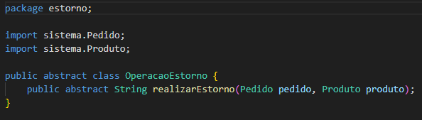

# GRASP Polimorfismo

## 1. Introdução

Padrões de projeto são princípios e soluções usados durante a criação de um software, codificados em um formato estruturado, descrevendo o problema e a respectiva solução adotada. Com isso, GRASP, ou Padrões de Software para Atribuição de Responsabilidade Geral em português, é um tipo de padrões de projeto que pode ser aplicado para o desenvolvimento de um projeto. Em outras palavras, os padrões GRASP são princípios descritos de modo metódico, explicável e repetível para atribuir as responsabilidades (fazer e conhecer) dos papéis (objetos).

## 2. GRASP Polimorfismo

No polimorfismo temos que subclasses que se originam de uma superclasse podem invocar métodos da segunda e sobrescrevê-los, já que cada subclasse tem um comportamento diferente.

O padrão polimorfismo trabalha na organização das classes utilizando operações polimórficas, fazendo com que as responsabilidades sejam atribuídas a abstrações condizentes ao invés de objetos concretos. 
    
### 2.1. Vantagens
	
- Apoia o princípio de baixo acoplamento;
- Útil em projetos com variações semelhantes;
- Facilidade em estender o projeto com novas funcionalidades;

### 2.2. Implementação no Mercado Livre

O GRASP polimorfismo foi utilizado na herança do processo de devolução e estorno, com suas especialidades escolhidas, possuindo funcionalidades diferentes no projeto.

#### 2.2.1 Diagramação UML

Segue nossa diagramação UML para representação da implementação do padrão de projeto polimorfismo. A diagramação foi abstraída do [diagrama de classe](../../Modelagem/UMLEstaticos/DiagramaDeClasses.md).

<figcaption align='center'>
    <b>Figura 1 : Diagramação UML</b>
     <small>Fonte: Elaboração Própria</small>
     <small>Autores: Gabriel Roger, Vinícius Assumpção e João Pedro</small>
</figcaption>

#### 2.2.2 Código

Segue abaixo exemplos da implementação de polimorfismo em código. Para o caso de estorno, foi utilizado uma classe pai OperacaoEstorno e classes filhas para cada motivo de estorno. Já para o caso de devolução, foi utilizado uma classe pai OperacaoDevolucao e classes filhas para cada motivo de devolução.

<figcaption align='center'>
    <b>Figura 1 : Diagramação UML</b>
     <small>Fonte: Elaboração Própria</small>
     <small>Autores: Gabriel Roger, Vinícius Assumpção e João Pedro</small>
</figcaption>

<figcaption align='center'>
    <b>Figura 1 : Diagramação UML</b>
     <small>Fonte: Elaboração Própria</small>
     <small>Autores: Gabriel Roger, Vinícius Assumpção e João Pedro</small>
</figcaption>

<figcaption align='center'>
    <b>Figura 1 : Diagramação UML</b>
     <small>Fonte: Elaboração Própria</small>
     <small>Autores: Gabriel Roger, Vinícius Assumpção e João Pedro</small>
</figcaption>

<figcaption align='center'>
    <b>Figura 1 : Diagramação UML</b>
     <small>Fonte: Elaboração Própria</small>
     <small>Autores: Gabriel Roger, Vinícius Assumpção e João Pedro</small>
</figcaption>

## 3. Referências

> Serrano, Milene. 2020. Aula GRASPs Parte I Conteúdo Complementar.  https://aprender3.unb.br/pluginfile.php/2277128/mod_label/intro/Arquitetura%20e%20Desenho%20de%20Software%20-%20Aula%20GRASP_A%20-%20Profa.%20Milene%20-%20Complementar.pdf. Acesso em: 05 de junho de 2023.

> Serrano, Milene. 2020. Aula GRASPs Parte II Conteúdo Complementar.  https://aprender3.unb.br/pluginfile.php/2277128/mod_label/intro/Arquitetura%20e%20Desenho%20de%20Software%20-%20Aula%20GRASP_B%20-%20Profa.%20Milene%20-%20Complementar.pdf. Acesso em: 05 de junho de 2023.

> BOAS, Leandro. Padrões GRASP — Padrões de Atribuir Responsabilidades. Medium, 2019. Disponível em: <https://medium.com/@leandrovboas/padr%C3%B5es-grasp-padr%C3%B5es-de-atribuir-responsabilidades-1ae4351eb204>. Acesso em: 05 de junho de 2023.

> Renato. Desenvolvimento com qualidade com GRASP. Devmedia, 2013. Disponível em: <https://www.devmedia.com.br/desenvolvimento-com-qualidade-com-grasp/28704>. Acesso em: 05 de junho de 2023.

> GRASP (padrão orientado a objetos). Wikipedia, 2020. Disponível em: <https://pt.wikipedia.org/wiki/GRASP_(padr%C3%A3o_orientado_a_objetos)>. Acesso em: 05 de junho de 2023.

## 4. Histórico de Versões

|    Data    | Versão |            Descrição           |       Autor     |    Revisor    |
|  --------  |  ----  |            ----------          | --------------- |    -------    |
| 05/06/2023 | 1.0.0 |  Configuração inicial do artefato de Padrões GRASPs | [Vinícius Assumpção](https://github.com/viniman27) , [Gabriel Roger](https://github.com/GabrielRoger07) e [João Pedro Vaz](https://github.com/JoaoPedro0803) | [Erick Levy](https://github.com/Ericklevy) |
| 12/06/2023 | 1.0.1 | Configuração inicial das imagens de modelagem e código | [Gabriel Roger](https://github.com/GabrielRoger07) | [Vinícius Assumpção](https://github.com/viniman27), [João Pedro Vaz](https://github.com/JoaoPedro0803) e [Erick Levy](https://github.com/Ericklevy) |
| 12/06/2023 | 1.0.2 | Adição de imagens e correção de hyperlink | [Gabriel Roger](https://github.com/GabrielRoger07) | [Vinícius Assumpção](https://github.com/viniman27), [João Pedro Vaz](https://github.com/JoaoPedro0803) e [Erick Levy](https://github.com/Ericklevy) |
