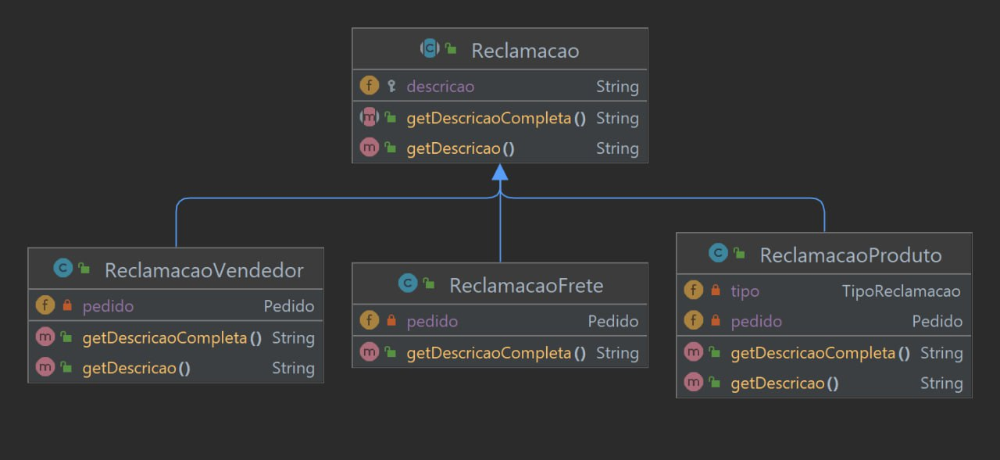

# GoF: Decorator Pattern

## 1. Introdução

<p align="justify">
    O padrão Decorator, definido pelo GoF, permite adicionar funcionalidades extras a um objeto de forma dinâmica. Em vez de criar subclasses, usa-se a composição. Uma classe base define a interface comum e um decorador abstrato contém uma referência ao objeto base. Decoradores concretos estendem o comportamento do objeto envolvendo-o. Isso evita a explosão de subclasses e permite personalização dinâmica. O Decorator é flexível, permitindo adicionar ou remover decoradores em tempo de execução. Em resumo, ele oferece uma maneira escalável e adaptável de estender objetos sem a necessidade de criar muitas subclasses.
</p>

## 2. Metodologia

<p align="justify">
    metodologia utilizada é a aplicação desses padrões para  atingir os objetivos do design do sistema.
    O padrão Decorator foi aplicado para permitir a adição dinâmica de comportamentos adicionais aos objetos existentes, sem modificar sua estrutura original. Isso é alcançado por meio da definição de uma classe abstrata base (Componente) que define a interface comum para componentes principais e decoradores. Os decoradores (ReclamacaoProduto, ReclamacaoFrete, ReclamacaoVendedor) estendem essa classe abstrata base e envolvem os componentes principais (Pedido) para adicionar funcionalidades extras, como a descrição detalhada da reclamação.
</p>

Decorator Design:
- Componente - Neste contexto, o termo "Componente" refere-se à classe abstrata base ou interface que define a funcionalidade principal ou o comportamento básico. É o elemento central do padrão Decorator e representa o objeto original que será decorado(Reclamacao.java).
- Componente Concreto - É a implementação específica do Componente, que fornece a funcionalidade básica sem decorações adicionais. Em outras palavras, é a classe concreta que implementa a interface ou herda da classe abstrata Componente(ReclamacaoFrete e ReclamacaoVendedor).
- Os decoradores, por sua vez, estendem ou envolvem os Componentes Concretos para adicionar funcionalidades extras sem alterar sua estrutura básica. No exemplo, as classes ReclamacaoProduto, ReclamacaoFrete e ReclamacaoVendedor agem como decoradores, adicionando comportamentos adicionais às reclamações.

## 3. Participantes
- [Abdul Hannan](https://github.com/hannanhunny01)

- [Erick Levy](https://github.com/Ericklevy)

- [Heitor Marques](https://github.com/heitormsb)


## Modelagem Reclamação


## Implementação de Código


`Reclamacao.java`

```
public abstract class Reclamacao {
    protected String descricao;

    public String getDescricao() {
        return descricao;
    }

    public abstract String getDescricaoCompleta();
}

```

`ReclamacaoProduto.java`

```
public class ReclamacaoProduto extends Reclamacao {
    private Pedido pedido;
    private TipoReclamacao tipo;

    public ReclamacaoProduto(Pedido pedido, TipoReclamacao tipo) {
        this.pedido = pedido;
        this.tipo = tipo;
    }

    @Override
    public String getDescricao() {
        return "Reclamação do produto: " + pedido.getProduto().getNome();
    }

    @Override
    public String getDescricaoCompleta() {
        return getDescricao() + " - Tipo: " + tipo.name();
    }
    
    // Padrão utilizado: Decorator (decorador específico para reclamação de produto)
}

```

`ReclamacaoFrete.java`

```
//Padrão: Decorator

public class ReclamacaoFrete extends Reclamacao {
    private Pedido pedido;

    public ReclamacaoFrete(Pedido pedido) {
        this.pedido = pedido;
        this.descricao = "Problema com o frete: ";
    }

    @Override
    public String getDescricaoCompleta() {
        return descricao + "Pedido #" + pedido.getIdPedido();
    }
}

```

`ReclamacaoVendedor.java`

```
public class ReclamacaoVendedor extends Reclamacao {
    private Pedido pedido;
    
    public ReclamacaoVendedor(Pedido pedido) {
        this.pedido = pedido;
    }
    
    @Override
    public String getDescricao() {
        return "Reclamação do vendedor do pedido: " + pedido.getIdPedido();
    }

    @Override
    public String getDescricaoCompleta() {
        return getDescricao();
    }
    
    // Padrão utilizado: Decorator (decorador específico para reclamação de vendedor)
}

```


No contexto do exemplo fornecido, a classe `Reclamacao` é o Componente, pois define a interface comum para as reclamações. Ela é a classe abstrata base que contém a declaração dos métodos que os decoradores devem implementar, como o método `getDescricao()`.Já o "Componente Concreto" se refere às classes que implementam o Componente e representam os objetos principais que serão decorados. No exemplo, as classes `ReclamacaoProduto, ReclamacaoFrete e ReclamacaoVendedor` são os Componentes Concretos. Elas estendem a classe `Reclamacao` e implementam os detalhes específicos de cada tipo de reclamação.


## 5. Conclusão

<p align="justify">
    O padrão Decorator oferece flexibilidade ao adicionar funcionalidades extras a um objeto em tempo de execução, sem modificar o código existente. Ele permite estender o comportamento de um objeto sem criar várias subclasses. A principal vantagem é a capacidade de adicionar dinamicamente comportamentos específicos, combinando diferentes decoradores conforme necessário. Isso evita subclasses complexas e melhora a modularidade e a reutilização de código. O Decorator facilita a manutenção e a evolução do software, evitando problemas da herança múltipla. Em resumo, o Decorator permite estender as capacidades de um objeto de forma flexível, agregando comportamentos adicionais em tempo de execução. Isso resulta em um design modular, flexível e fácil de manter.

</p>

## 6. Referências

> Padrão de Projeto Decorator em Java. Disponível em: <https://www.devmedia.com.br/padrao-de-projeto-decorator-em-java/26238>. Acesso em: 09 junho. 2023.


> Decorator. Disponível em: <https://refactoring.guru/pt-br/design-patterns/decorator#:~:text=O%20Decorator%20%C3%A9%20um%20padr%C3%A3o,objetos%20que%20cont%C3%A9m%20os%20comportamentos.> Acesso em: 09 junho. 2023.

## 7. Histórico de versionamento

|Data | Versão | Descrição | Autor(es)|Revisores|
| -- | -- | -- | -- |--|
|11/06/2023|1.0|Criação do Documento de Gof Decorator| [Abdul Hannan](https://github.com/hannanhunny01) <br>   [Erick Levy](https://github.com/Ericklevy) e [Heitor Marques](https://github.com/heitormsb)| 
|12/06/2023|1.1|Adicao do Diagrama uml| [Abdul Hannan](https://github.com/hannanhunny01) <br>   [Erick Levy](https://github.com/Ericklevy) e [Heitor Marques](https://github.com/heitormsb)| 
