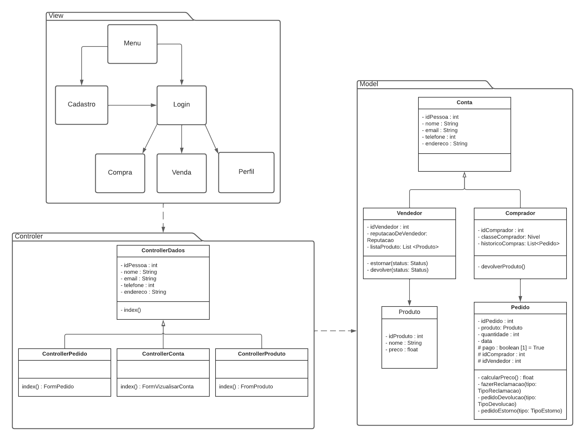
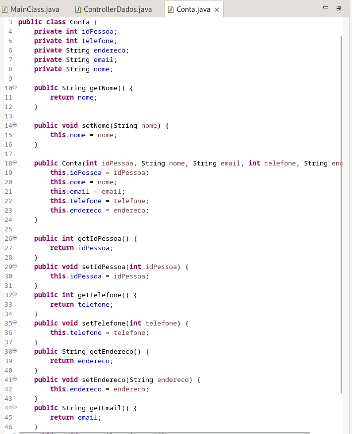
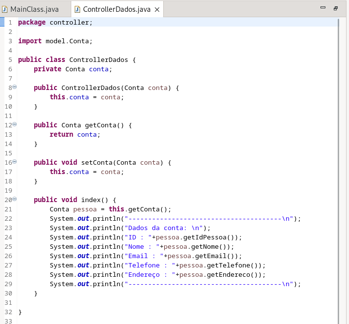
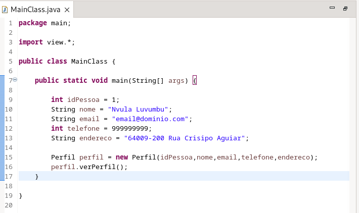

# MVC - Model-View-Controller

## 1. Introdução: Design Patterns e o padrão arquitetural MVC

Padrões de projeto arquiteturais são soluções abstratas para problemas recorrentes no design de sistemas de software em um nível mais amplo, relacionados à estruturação, organização e interações entre os componentes de um sistema. Esses padrões fornecem diretrizes de alto nível para ajudar a criar sistemas robustos, flexíveis e de fácil manutenção.

Um exemplo de padrão de projeto arquitetural é o *Modelo-View-Controller (MVC)*. No MVC, o modelo representa a lógica de negócios e os dados subjacentes do sistema, a visão é responsável pela apresentação dos dados ao usuário e o controlador atua como intermediário entre o modelo e a visão, gerenciando as interações do usuário e atualizando o modelo e a visão conforme necessário.

Outra informação relevante refere-se ao MVC ser amplamente utilizado em aplicações web e desktop para separar a lógica de negócios, a apresentação dos dados e a interação do usuário, permitindo uma melhor organização e manutenção do código. Ele oferece benefícios como a reutilização de código, a modificação independente da interface do usuário e a escalabilidade do sistema. Assim, os padrões de projeto arquiteturais, como o MVC, fornecem uma estrutura e diretrizes para projetar a estrutura geral de um sistema, promovendo a modularidade, a reusabilidade e a manutenibilidade.

## 2. Metodologia

A metodologia do Modelo-View-Controller (MVC) é uma abordagem de desenvolvimento de software que segue uma estrutura organizacional específica. Ela divide as responsabilidades em três componentes principais: o Modelo (Model), a Visão (View) e o Controlador (Controller).

* ***Modelo (Model)***: O modelo representa a lógica de negócios e os dados subjacentes da aplicação. Ele é responsável por armazenar e gerenciar os dados, bem como fornecer operações para acessar, atualizar e manipular esses dados. O modelo encapsula a funcionalidade central da aplicação e é independente da interface do usuário.

* ***Visão (View):*** A visão é responsável pela apresentação dos dados ao usuário. Ela exibe visualmente as informações fornecidas pelo modelo e interage com o usuário. A visão é responsável pela renderização dos dados de forma adequada, seguindo as regras de apresentação definidas. Pode haver várias visões diferentes que exibem os mesmos dados de maneiras distintas, dependendo dos requisitos e das preferências do usuário.

* ***Controlador (Controller):*** O controlador atua como intermediário entre o modelo e a visão. Ele recebe as interações do usuário na interface (como cliques, digitação etc.) e atualiza o modelo ou a visão, conforme necessário. O controlador processa as solicitações do usuário, manipula a lógica de negócios adicional, coordena a interação entre o modelo e a visão e mantém a consistência do sistema.

A interação entre os componentes é gerenciada de acordo com o fluxo de controle do MVC. Normalmente, o usuário interage com a visão, que aciona eventos que são capturados pelo controlador. O controlador, por sua vez, atualiza o modelo conforme necessário e notifica a visão sobre as alterações. A visão, então, obtém os dados atualizados do modelo e os apresenta ao usuário.

 

## 3. Diagrama de Pacotes MVC do Projeto Mercado Livre

Diante do exposto, a partir da modelagem conceitual [diagrama geral de classes](https://unbarqdsw2023-1.github.io/2023.1_G3_ProjetoMercadoLivre/#/Modelagem/UMLEstaticos/DiagramaDeClasses), foi desenvolvido um diagrama de pacotes, mais precisamente contendo 3 pacotes, um para cada nível de responsabilidade (Modelo, Visão e Controlador). Por meio desse diagrama, é possível vizualisar o fluxo de páginas a partir de associações simples entre as páginas de interação com os usuários no pacote View, as  regras de negócio, entidades, camada de acesso à dados no pacote Model  e, por fim, a coordenação e controle do fluxo de dados entre a model e a view no pacote Controller. A figura a seguir apresenta-nos este diagrama.

 

<figcaption align='center'>
    
Figura 1: Diagrama de pacotes MVC

</figcaption>

## 4. Exemplo de código

### 4.1 Exemplo de Model

### 4.2 Controller

### 4.3 View 

## 5. Conclusão

Com o artefato MVC em mãos, temos uma modelagem arquitetural a qual traz uma organização geral para o sistema. Além disso, o MVC pode ser combinado com outros padrões e princípios de design, como o GRASP e o GOF, para obter soluções mais completas e eficazes. O GRASP auxilia na definição correta das responsabilidades entre as classes e objetos do MVC, enquanto o GOF oferece uma coleção de padrões que podem ser aplicados para resolver problemas específicos dentro do contexto do MVC.
No geral, o padrão MVC promove a modularidade, a reutilização de código, a legibilidade e a manutenção simplificada. Ele continua sendo uma abordagem popular e valiosa no desenvolvimento de software, especialmente em aplicações que exigem uma separação clara entre a lógica de negócios e a interface do usuário.

 

## Referências Bibliográficas

[1] What is Model-View and Control? Disponível em: <https://www.visual-paradigm.com/guide/uml-unified-modeling-language/what-is-model-view-control-mvc/>.

## Histórico de versionamento

| Data | Versão | Descrição | Autor | Revisor |
| ---- | ------ | --------- | ----- | ------- |
| 09/06/2023 | 1.0 | Criação do documento | [Gustavo Martins](https://github.com/gustavomartins-github) | [Erick Levy](https://github.com/Ericklevy) |
| 11/06/2023 | 1.1 | Correção do documento | [Rodolfo Neves](https://github.com/roddas) | [Lucas Monteiro](https://github.com/nickby2) |
| 12/06/2023 | 1.2 | Adição do exemplo MVC | [Rodolfo Neves](https://github.com/roddas) | [Lucas Monteiro](https://github.com/nickby2) |
