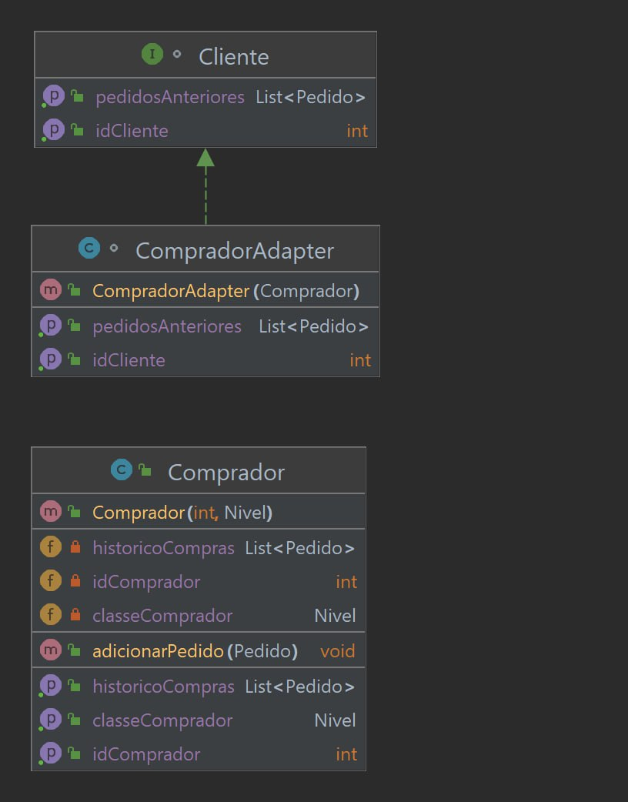

# Padrão GoF: Adapter

## Introdução
O padrão Adapter é um dos padrões estruturais do GoF (Gang of Four). Ele permite que objetos com interfaces incompatíveis trabalhem juntos. O Adapter atua como uma camada intermediária entre dois objetos, convertendo a interface de um objeto para outra interface que o cliente espera.

## Metodologia
A implementação do padrão Adapter envolve os seguintes participantes:

 - Alvo (Target): Define a interface específica que o Cliente usa.
 - Adaptador (Adapter): Adapta a interface Adaptee para a interface Alvo. Implementa a interface Alvo e mantém uma referência ao objeto Adaptee.
 - Adaptee: Define uma interface existente que precisa ser adaptada.
 - Cliente (Client): Colabora com o objeto do tipo Alvo, usando os métodos definidos pela interface Alvo.
Participantes

## Participantes
  |Nome|
  |--|
  |Abdul hannan|
  |Erick Levy Barbosa dos Santos|
  |HEITOR MARQUES SIMÕES BARBOSA|

## Modelagem Compras


## Implementação de Código
A implementaçao do codigo do padrao GOF completa pode ser encontrada [aqui](https://github.com/UnBArqDsw2023-1/2023.1_G3_ProjetoMercadoLivre/tree/main/docs/PadroesDeProjeto/CodigoGOF/Arquitetura/src)
``` ts


// A classe Comprador representa um comprador no sistema de compras
public class Comprador {
    private int idComprador;
    private Nivel classeComprador;
    private List<Pedido> historicoCompras;

    // Construtor da classe Comprador
    public Comprador(int idComprador, Nivel classeComprador) {
        this.idComprador = idComprador;
        this.classeComprador = classeComprador;
        this.historicoCompras = new ArrayList<>();
    }

    // Retorna o ID do comprador
    public int getIdComprador() {
        return idComprador;
    }

    // Retorna a classe do comprador
    public Nivel getClasseComprador() {
        return classeComprador;
    }

    // Retorna o histórico de compras do comprador
    public List<Pedido> getHistoricoCompras() {
        return historicoCompras;
    }

    // Adiciona um pedido ao histórico de compras do comprador
    public void adicionarPedido(Pedido pedido) {
        historicoCompras.add(pedido);
    }
}

// A interface Cliente define os métodos que um cliente deve implementar
interface Cliente {
    int getIdCliente();
    List<Pedido> getPedidosAnteriores();
}

// A classe CompradorAdapter adapta a classe Comprador para implementar a interface Cliente
class CompradorAdapter implements Cliente {
    private Comprador comprador;

    // Construtor da classe CompradorAdapter
    public CompradorAdapter(Comprador comprador) {
        this.comprador = comprador;
    }

    // Retorna o ID do cliente, que é obtido do Comprador
    @Override
    public int getIdCliente() {
        return comprador.getIdComprador();
    }

    // Retorna os pedidos anteriores do cliente, que são obtidos do histórico de compras do Comprador
    @Override
    public List<Pedido> getPedidosAnteriores() {
        return comprador.getHistoricoCompras();
    }
}
```
## Video
<iframe src="https://unbbr.sharepoint.com/sites/GrupoF.Experimental1/_layouts/15/embed.aspx?UniqueId=263e098e-bb28-48b1-9caf-c645b8f21847&embed=%7B%22ust%22%3Atrue%2C%22hv%22%3A%22CopyEmbedCode%22%7D&referrer=StreamWebApp&referrerScenario=EmbedDialog.Create" width="640" height="360" frameborder="0" scrolling="no" allowfullscreen title="Meeting in _General_-20230612_232217-Meeting Recording.mp4"></iframe>

## Referências

Referência: Adapter Pattern. Disponível em: https://www.tutorialspoint.com/design_pattern/adapter_pattern.htm. Acesso em: 11 jul. 2023.

Referência: Adapter Pattern GoFs. Disponível em: https://refactoring.guru/design-patterns/adapter
. Acesso em: 11 jul. 2023.

## Histórico de versões

|Data | Versão | Descrição | Autor(es)|Revisores|
| -- | -- | -- | -- |--|
|11/06/2023|1.0|Criação do Documento de Gof Adapter| [Abdul Hannan](https://github.com/hannanhunny01) <br>   [Erick Levy](https://github.com/Ericklevy) e [Heitor Marques](https://github.com/heitormsb)| 
|12/06/2023|1.1|Adicao do Diagrama uml| [Abdul Hannan](https://github.com/hannanhunny01) <br>   [Erick Levy](https://github.com/Ericklevy) e [Heitor Marques](https://github.com/heitormsb)| 
