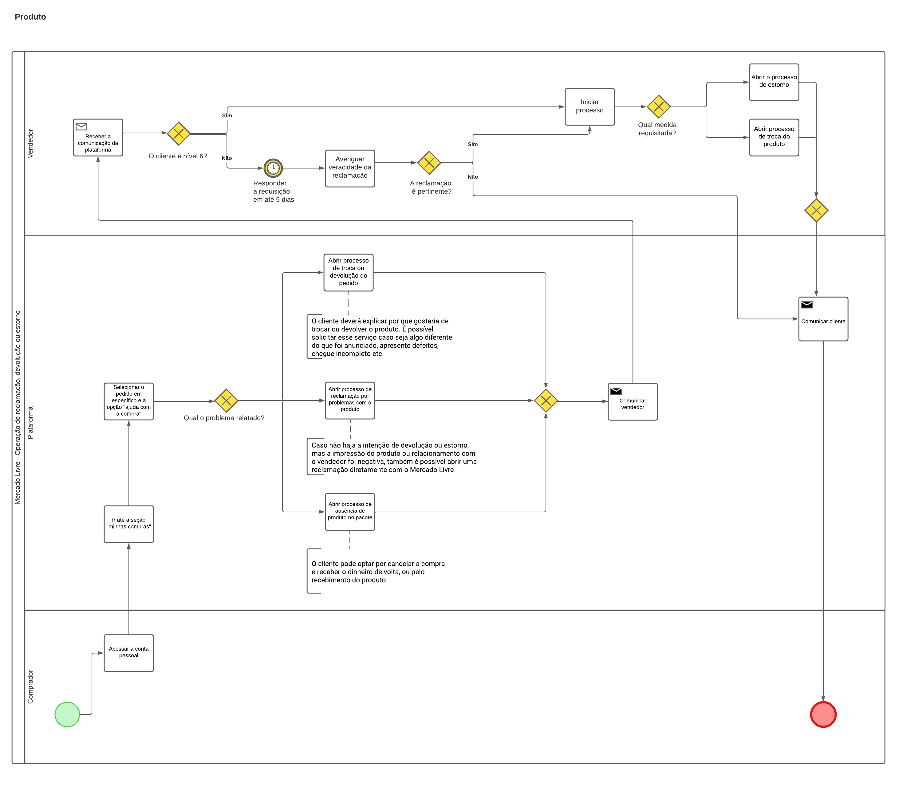

# 2023.1_G3_ProjetoMercadoLivre

Esse é o repositório de documentação da equipe.

# Mercado Livre

**Código da Disciplina**: FGA0208 
**Número do Grupo**: 03

## Alunos
|Matrícula | Aluno |
|--|--|
| 20/2045624 | [Abdul Hannan](https://github.com/hannanhunny01) |
| 18/0016067 | [Erick Levy](https://github.com/Ericklevy) |
| 19/0055006 | [Gian medeiros](https://github.com/GianMedeiros) |
| 20/0018248  |  [Gabriel Roger Amorim da Cruz](https://github.com/GabrielRoger07) |
| 20/0019228 | [Gustavo Martins](https://github.com/gustavomartins-github) |
| 20/2016462 | [Heitor Marques](https://github.com/heitormsb) |
| 20/0020650  |  [João Pedro de Camargo Vaz](https://github.com/JoaoPedro0803) |
| 18/0042378 | [Kathlyn Lara](https://github.com/klmurussi) |
| -- | [Lucas Rodrigues](https://github.com/nickby2) |
| 18/0011472 | [Rodolfo Neves](https://github.com/roddas) |
| 20/0028472  |  [Vinícius Assumpção](https://github.com/viniman27) |

## Sobre 
O projeto será uma aplicação WEB, de preferência responsiva, onde atenderá as necessidades de um cliente e um vendedor da plataforma Mercado Livre em relação aos processos de reclamação, estorno, devolução e/ou troca. 

## Screenshots Primeira Entrega 

### BPMN

### StoryBoard

## Screenshots Segunda Entrega <<FOCO:Modelagem&>>

## Screenshots Terceira Entrega <<FOCO: Padrões de Projeto>>

## Screenshots Quarta Entrega  <<FOCOS: Arquitetura & Reutilização de Software & PROJETO FINAL>>

## Descritivo dos Principais Aspectos Técnicos 
**Principal(is) Metodologia(s) Adotada(s)**: Scrum, Kanban e XP 
**Principais Linguagens Utilizadas e/ou Pretendidas**: Python e JavaScript 
**Principais Tecnologias Utilizadas e/ou Pretendidas**: Django (Back-end) e React (Front-end) 
**Principal(is) Estilo(s) Arquitetural(is) Adotado(s)**: xxxxxx 
